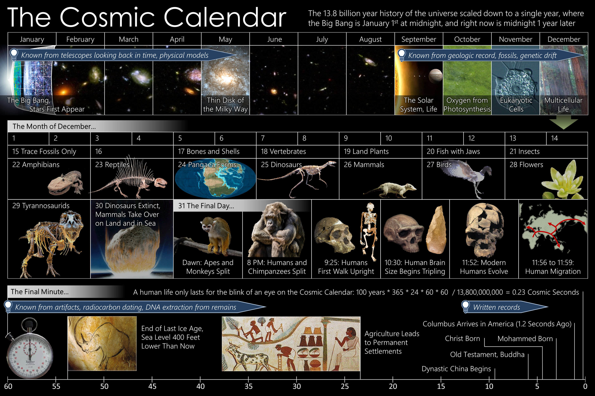
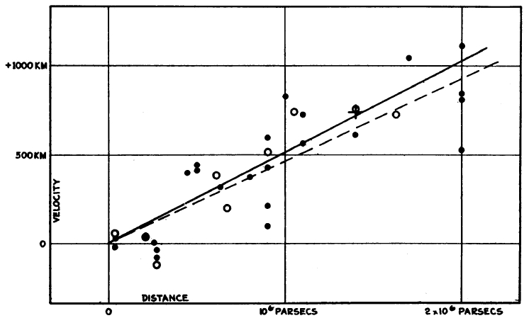

# Overview of Observational Cosmology {#ch:intro_obs}

This section introduces the observational foundation of Cosmology. It
builds upon the material in PH30111: Introduction to Galaxies and
Cosmology. Some material may be familiar to you, but the origins and
derivations of the equations will be discussed in more depth, and will
include the relativistic treatment introduced in the first half of this
course.

The Cosmological Principle {#sec:cosmoprinciple}
--------------------------

The Cosmological Principle is the belief that **our position in the
Universe is not special in any way**.

If the Cosmological Principle holds, then there is no special position
in the Universe, meaning that it should be the same everywhere (i.e. it
should be **homogeneous**), and it should have no preferred direction
(i.e. it should be **isotropic**)

Clearly the Universe is not isotropic and homogeneous on small scales --
the distributions of things like stars, planets and galaxies give more
or less dense regions locally. But on a large scale, the Universe does
display homogeneity and isotropy; Galaxy clusters are spread over the
Universe and not concentrated to one side, and the CMB has only very
tiny fluctuations.

A brief history of the Universe {#sec:history}
-------------------------------

The 'Cosmic Calendar' shown in
Figure \@ref(fig:cosmic-calendar) condenses the evolution of the Universe
to a timescale of 1 calendar year. If the Big Bang occurred on January
1st, human life wouldn't exist until 11:52pm on 31st December! The
formation of the Solar System would have occurred in September, and our
home in the Galaxy, the disk of the Milky Way, would have formed in May.

As
Figure \@ref(fig:cosmic-calendar) shows, our understanding of how the
Universe and our place in it has evolved over time uses different
sources of evidence depending on the time frame. Our knowledge of recent
history comes from written records, while our knowledge of the formation
of the Solar System and the evolution of Earth comes from geology.
However, to understand how the Universe as a whole came to be, we must
look further back in time.

```{r echo=FALSE, cosmic-calendar, out.width='100%', fig.show='hold', fig.cap='The Cosmic Calendar. Credit: By Efbrazil, CC BY-SA 3.0.'}

```


Figure \@ref(fig:evo-universe) illustrates our current understanding of
the evolution of the Universe, starting with the Big Bang, through to
the Universe as we see it today. This section gives a brief history of
the evolution; topics will be covered in further detail later in the
course. We will not move through these chronologically in this course;
instead this is intended to give you an overview of how the different
ideas we cover come together.

```{r echo=FALSE, evo-universe, out.width='100%', fig.show='hold', fig.cap='Evolution of the Universe. Original image credit: NASA/WMAP Science Team'}
knitr::include_graphics("Images/060915_CMB_Timeline150_annotated.jpg")
```


The first second {#sec:first_second}
-------------------------------

The first second after the Big Bang was quite dramatic. Highlights of
this time are given below. Bear in mind that all of the following
happens in less time than it takes for your heart to beat twice.

 - The Big Bang $(t = 0)$ 

The Universe began with the Big Bang, rapidly expanding from an initial
singularity.

 - Planck epoch $(t = 10^{-43}~s)$ 

The Planck epoch refers to the stage when the Universe's density
exceeded a critical density, such that the energy scale is greater than
the Planck scale. At this scale, quantum effects are important even for
gravitational physics.

 - Separation of forces $(10^{-43}~s < t < 10^{-36}~s)$ 

After the Planck epoch, other fundamental forces start to separate out.
First, the gravitational force and electronuclear force decouple, then
the electronuclear force separates out into the strong and electroweak
forces.

 - Inflation $(t < 10^{-32}~s)$ 

Early in its evolution, the Universe underwent a period of rapid
inflation, expanding by a factor of $10^{78}$ (or $10^{26}$ in each of
the three spatial dimensions). Under this rapid expansion, an area of
space of the order of 1 nm$^{3}$ would expand to approximately
30 pc$^{3}$ (equivalent to around 100 lyr$^{3})$. Such expansion must
occur at greater than the speed of light ($c$). However, as it is the
metric of space time that is expanding, the limitation of exceeding $c$
is not applicable, and inflation can occur.

 - Electroweak symmetry breaking $(t = 10^{-12}~s)$ 

After inflation, the electroweak force separates into the
electromagnetic and weak nuclear forces.

 - Quark epoch $(t = 10^{-12}~s)$ 

At the same time as electroweak symmetry breaking, the energy density of
the Universe has decreased such that matter can exist in the form of
quarks.

 - Baryogenesis $(t = 10^{-11}~s)$ 

Baryogenesis is the stage where matter can start to exist in the form of
baryons - e.g. protons, neutrons. Baryogensis should have produced both
baryons and anti-baryons (e.g. protons and anti-protons). Current
evidence - i.e. the fact that we exist and are composed of baryons -
shows that there must have been an asymmetry in the proportions of
baryons/anti-baryons, otherwise they would have all have annihilated.
The Baryogenesis process and baryon asymmetry are current areas of
research.

 - Hadron epoch $(10^{-6}~s < t < 1~s)$ 

The Hadron epoch occurred when the Universe had cooled far enough for
hadrons to exist and dominate the energy density. The proportions of
hadrons and anti-hadrons were similar, such that they were in thermal
equilibrium and mostly annihilated, producing photons, although a small
number of hadrons remained.

 - Neutrino decoupling $(t < 1~s)$ 

Around 1s after the Big Bang, neutrinos decoupled and were free to
propagate through the Universe. Neutrinos have a very small interaction
cross section, so the Cosmic Neutrino Background created at neutrino
decoupling should still exist today. However, as the neutrinos produced
at decoupling have such low energies, it is impossible to detect them
with current experiments.

 - Lepton epoch $(1~s < t < 10~s)$ 

Similar to the Hadron epoch, the Lepton epoch produced both leptons and
anti-leptons (e.g, electrons, muons, neutrinos etc.) These would have
annihilated, producing pairs of photons. A small number of leptons
remain after annihilation.

After the first second: {#sec:after_1s}
-------------------------------

The Universe has now been evolving for around 1 s. It has exponentially
expanded, created all the matter and radiation we see (and destroyed a
whole load too), and gone through several rounds of fundamental physical
forces. What else is left to do for the next 13.77 billion years?

 - Photon epoch $(10~s < t < 377,000\text{ years})$ 

After baryons, hadrons and leptons have mostly been annihilated, the
majority of the Universe's energy is dominated by photons.

 - Light Element Nucleosynthesis $(2 \text{ mins} < t < 20\text{ mins})$ 

Nucleosynthesis is the stage where light elements (i.e., Hydrogen,
Deuterium, Helium, Lithium) were formed. Elements heavier than Helium
were very difficult to form due to the large amounts of energy/time
required.

 - Matter domination $(t = 47,000\text{ years})$ 

Around 47,000 years after the Big Bang, the energy density of matter in
the Universe overtakes that of radiation. Matter now becomes the
dominant driver of the Universe's evolution.

 - Epoch of recombination and photon decoupling $(t = 377,000\text{ years})$ 

During the epoch of recombination, ionised particles (e.g. electrons,
protons) combined to form neutral atoms. At this stage, the matter
density was such that photons only had a short path length before they
would interact with an ionised particle, making the Universe opaque. As
recombination progressed, and ionised particles combined into neutral
atoms, the photon path length increased, making the Universe transparent
to photons. The decoupled photons produced during this time have been
redshifted by the expansion of the Universe, so we now observe them as
the Cosmic Microwave Background (CMB).

 - Dark Ages $(380,000 \text{ years}< t < 1\text{ Gyr})$ 

At this time, photons were free to stream through the Universe. However,
light-producing systems such as stars had not yet formed, so the
Universe was \"dark\". The only sources of photons were those from the
CMB, and those emitted from neutral Hydrogen atoms at 21 cm.

 - Formation of structure $(150\text{ Myr} < t < 1\text{ Gyr})$ 

Structure forms hierarchically in the Universe; smaller structures form
first and are built up into larger ones. The first structures to form in
the Universe were stars, dwarf galaxies, and quasars. The first
population of stars (Population III stars) are thought to have formed
around t $=700$ Myr. Pop III stars are yet to be detected
observationally.

 - Epoch of reionisation $(250 \text{ Myr} < t 1\text{ Gyr})$ 

Pop III stars introduced a new source of radiation into the Universe.
During the epoch of reionisation this radiation ionised the neutral
Hydrogen, creating a plasma of protons and electrons. The epoch of
reionisation most likely lasted until around 1 Gyr, when the Population
III stars died off. At this time, the ionised Hydrogen gradually
recombined to neutral Hydrogen once more.

 - Formation of Galaxies and Clusters $(t$\>$1 \text{ Gyr})$ 

\"Large\" galaxies and galaxy clusters formed from around t = 1 Gyr.
These would have first comprised Population II stars, which, unlike Pop
III stars, we do observe today. Later, the next generation of stars, Pop
I, formed.

 - Dark Energy epoch $(t > 9.8 \text{ Gyr})$ 

We are currently believed to be in the dark energy epoch, where the
energy density of the Universe is dominated by the dark energy
contribution. While we don't know the nature of dark energy, its effects
are seen as driving the expansion of the Universe so it is not just
getting larger, but the expansion itself is accelerating.


The Expanding Universe {#sec:expanding_intro}
----------------------

The first observational evidence that the Universe is expanding was
found by Edwin Hubble [@1929Hubble]. By measuring the distances
to nearby galaxies using the Cepheid Leavitt Law, and comparing
these distances to the galaxies' redshifts. Hubble measured the
expansion rate of the Universe (the **Hubble constant, $\mathbf{H_0}$**)
to be approximately 500 km s$^{-1}$ Mpc$^{-1}$. Hubble's observations
are shown in
Figure \@ref(fig:hubble-h0-diagram). Throughout this course we will
explore how observations of the Universe have developed over the past
century, increasing in precision and accuracy, leading to our current
understanding of Cosmology.

```{r echo=FALSE, hubble-h0-diagram, out.width='100%', fig.show='hold', fig.cap='The first observational evidence of the expanding Universe. His first measurement of the expansion rate, now known as the Hubble constant, was 500 km s$^{-1}$ Mpc$^{-1}$. From [@1929Hubble].'}

```


