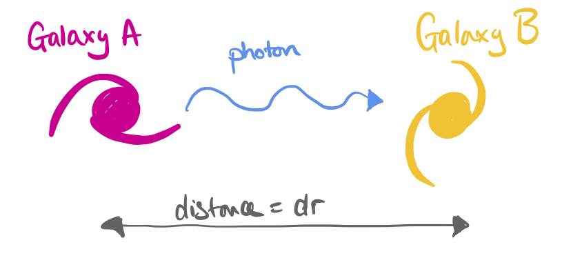
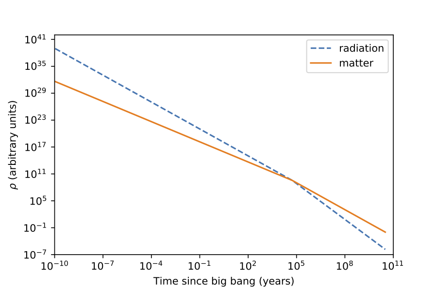

Composition of the Universe {#ch:constituents}
===========================

**Updates - 24/4/20**: I have updated the derivations in the matter and radiation sections to include the correct $a_0$ proportionality constant.

Like all good physicists, Cosmologists like to simplify the Universe
with assumptions. In the previous section we decided that the Universe
is a perfect fluid. We're continuing with that assumption here, now
looking at how the different components of the Universe behave.

In Section \@ref(sec:fluid-eqns) we stated that any possible components of
the Universe could be described as perfect fluids. On a Cosmological
scale, this is a reasonable assumption. However, not all Cosmological
fluids behave in the same way. Each component will obey its own
**equation of state** that describes how its pressure ($P$) and density
($\rho$) are related.

Matter {#sec:matter-eos}
------

The simplest place to start is with the equation of state for matter, as
that is the component that we are most familiar with. We know that for
matter $$P = 0$$ which we can substitute into the Fluid equation (Eqn. \@ref(eq:fluid)) to find
\begin{equation}
    \dot{\rho} + 3\dfrac{\dot{a}}{a}\rho = 0
(\#eq:fluid-matter-1)
\end{equation}
Again, using our amazing
differentiation skillz, we can show that Eqn \@ref(eq:fluid-matter-1) can be rewritten as
\begin{equation}
\dfrac{1}{a^3}\dfrac{d}{dt}\left(\rho a^3\right) = 0
(\#eq:fluid-matter-2)
\end{equation}
This means that
\begin{equation}
\dfrac{d}{dt}\left(\rho a^3\right) = 0
(\#eq:fluid-matter-2)
\end{equation}
or that 
\begin{equation}
    \rho a^3 = \text{constant,} \text{ or }\rho \propto \dfrac{1}{a^3}
    (\#eq:fluid-matter-3)
\end{equation}

This is not a surprising answer; it's telling us that the density falls
off with $a^3$. We know that intuitively -- if you keep the amount of
material the same, but increase the volume, the density will fall off
proportionally. We can rewrite this as 
\begin{equation}
\rho = \dfrac{\rho_0 a_0^3}{a^3}
(\#eq:fluid-matter-4)
\end{equation}
where $\rho_0$ and $a_0$ denote the *present day* values.

Now that we know how the density of the Universe evolves with the scale
factor, we can look further into the fate of a "matter dominated"
Universe.

:::fyi
**Power laws**

In case you hadn't realised by now, a lot of Cosmology is built on
assumptions and estimation. Luckily, these estimates describe evolution
of the Universe very well. One such estimate is the **power law** -- the
astronomers favourite tool for estimating relations. Power laws, e.g
$a \propto t^q$ crop up frequently in astronomy and cosmology, so it's
useful to be able to recognise when to use them.

Substituting Eqn. \@ref(eq:fluid-matter-4) into the Friedman equation (and assuming $k=0$)
gives 
\begin{equation}
\dot{a}^2 = \dfrac{8\pi G \rho_0}{3}\dfrac{1}{a}
(\#eq:power-1)
\end{equation}
We can substitute in the power law $a \propto t^q$ to find a relation between
$a$, $\rho$ and $t$: 
\begin{equation}
t^{(2q-2)} \propto t^{-q}
(\#eq:power-2)
\end{equation}
which gives us
$q = 2/3$, or 
\begin{align}
    a(t) &= a_0 \left(\dfrac{t}{t_0}\right)^{2/3}\\
    \rho(t) &= \dfrac{\rho_0 a_0^3 }{a^3} = \dfrac{\rho_0 t_{0}^{2}}{t^2}
    (\#eq:power-3)
\end{align}
The Hubble parameter, $H(t)$, is a measure of the expansion rate of the
Universe at time $t$ (note that $H(t)$ is different to the Hubble constant, $H_0$, which is a measure of
    the expansion rate at the present time). $H(t)$ is therefore related to $a$, and hence
$t$: 
\begin{equation}
H(t) \equiv \dfrac{\dot{a}}{a} = \dfrac{2}{3t}
(\#eq:power-4)
\end{equation}
As discussed in Section \@ref(sec:curvature), we can see that in this $k=0$, matter
dominated Universe, the expansion will continue forever. It will slow
down over time, becoming infinitely slow at $t=\infty$.
:::


Radiation {#sec:radiation-eos}
---------

The equation of state for radiation is 
\begin{equation}
P = \dfrac{\rho c^2}{3}
(\#eq:rad-eos-1)
\end{equation}
which we can substitute into the Fluid equation
(Eqn. \@ref(eq:fluid)):
\begin{align}
    \dot{\rho} + 3\dfrac{\dot{a}}{a}\left(\rho + \dfrac{\rho c^2}{3}\right) &= 0\\
    \dot{\rho} + 4\dfrac{\dot{a}}{a}\rho &= 0
(\#eq:rad-eos-2)
\end{align}
Using the
same power law analysis as in
Section \@ref(sec:matter-eos), i.e. $a \propto t^q$, we find that
$q = 1/2$, leading to: 
\begin{equation}
\begin{array}{lcr}
    \rho \propto \dfrac{1}{a^4} & \qquad a(t) = a_0 \left(\dfrac{t}{t_0}\right)^{1/2} & \qquad \rho(t) = \dfrac{\rho_0 a_0^4}{a^4} = \dfrac{\rho_0 t_0^2}{t^2}\\
\end{array}
(\#eq:rad-eos-3)    
\end{equation}

In the radiation dominated case, $\rho(t)$ decreases with $t^2$, as is
the case with the matter dominated case. However, when we consider the
scale factor, $a$, we find:
$$H(t) \equiv \dfrac{\dot{a}}{a} = \dfrac{1}{2t}$$ meaning that the
Universe expands *more slowly* when it is radiation dominated than when
it is matter dominated.

This may seem counter-intuitive at first; for a matter dominated Universe
the energy density is proportional to the volume of the Universe
($1/a^3$), so why is this not the same for a radiation dominated
Universe? The answer lies in what happens to radiation under an increase
in the scale factor.

## Why does a radiation dominated Universe expand more slowly? {#sec:slow_expansion_rad}

As the Universe expands, the scale factor $a$ increases. The energy
density of the radiation will decrease proportionally as the volume
increases. However, the radiation loses additional energy, proportional
to $a$, as the photons are redshifted.

```{r echo=FALSE, redshift-galaxies, out.width='100%', fig.show='hold', fig.cap='A photon travelling between two galaxies'}

```


Consider a photon travelling between two points in space, as shown in
Figure \@ref(fig:redshift-galaxies). The relative velocities of the
galaxies in
Fig. \@ref(fig:redshift-galaxies) is given by 

\begin{equation}
dv = H dr = \dfrac{\dot{a}}{a} dr
(\#eq:red-1)
\end{equation}

We can use the Doppler law to
find the change of the photon's wavelength, $d\lambda$, while it's
travelling between the two positions 

\begin{equation}
\dfrac{d\lambda}{\lambda} = \dfrac{dv}{c}
(\#eq:red-2)
\end{equation}

The travel time of the
photon is $dt = dr/c$, which we can combine with
Equations \@ref(eq:red-1) and \@ref(eq:red-2)
to find

\begin{equation}
\dfrac{d\lambda}{\lambda} = \dfrac{\dot{a}}{a} \dfrac{dr}{c} = \dfrac{\dot{a}}{a} dt
(\#eq:lambda-a)
\end{equation}

Integrating Equation \@ref(eq:lambda-a) shows that
$\ln \lambda = \ln a + \text{constant}$, i.e. 
\begin{equation}
\lambda \propto a
(\#eq:lambda-a-2)
\end{equation}

The energy of a photon is proportional to its wavelength, so
\begin{equation}
E = \dfrac{h c}{\lambda} \propto \dfrac{1}{a}
(\#eq:lambda-a-3)
\end{equation}
This reduction in
energy by an additional factor of $a$ accounts for the slowed expansion
in a radiation dominated Universe.

Mixing matter and radiation {#sec:mixtures}
---------------------------

In Sections \@ref(sec:matter-eos) and
\@ref(sec:radiation-eos) we considered the cases where the
Universe was composed of either only matter or only radiation. This is
not particularly realistic; the Universe contains a mixture of these two
components.

We found that the energy densities of matter and radiation are related
to the scale factor by different amounts, with the radiation energy
density decreasing more quickly as $a$ increases: 

\begin{equation}
\begin{array}{lr}
    \rho_{\text{mat}} \propto \dfrac{1}{a^3} & \qquad
    \rho_{\text{rad}} \propto \dfrac{1}{a^4}
\end{array}
(\#eq:rad-mat-1)
\end{equation}
Even though the Universe is a mixture of matter and
radiation, it still obeys the Friedman equation
(Eqn. \@ref(eq:friedman)) in the same way, with the individual
densities combined into a single value of $\rho$:
\begin{equation}
\rho = \rho_{\text{mat}} + \rho_{\text{rad}}
(\#eq:rho-mat-rad)
\end{equation}
We could solve the
Friedman equation in full, but in practice only the dominant density term significantly affects the evolution of the scale factor at any
given time.

At early times, the radiation energy density will dominate over the
matter energy density, meaning that $a$ will evolve as in the radiation
case: 
\begin{equation}
a(t) \propto t^{1/2}
(\#eq:a-t)
\end{equation}
Combining this with our individual
equations for $\rho(t)$ we find 
\begin{equation}
\rho_{\text{rad}} \propto \dfrac{1}{t^2}
(\#eq:rho-rad-t)
\end{equation}
for the radiation dominated case, and
\begin{equation}
     \rho_{\text{mat}} \propto \dfrac{1}{a^3} \propto \dfrac{1}{t^{3/2}}
(\#eq:rho-mat-t)
\end{equation}
for the matter dominated case.


```{r echo=FALSE, density-fig, out.width='100%', fig.show='hold', fig.cap='Evolution of the matter (orange solid line) and radiation (blue dashed line) density components as a function of time in a mixed composition Universe. Radiation dominates for early times, but as $t$ (hence $a$) increases, matter becomes the dominant component.'}

```

Initially, radiation will dominate. However, as $t$ increases, the
energy density contribution from matter will dominate over radiation, as
shown in
Figure \@ref(fig:density-fig). However, when the matter density
dominates, $a$ will evolve as in the matter case: 
\begin{equation}
\begin{array}{lcr}
    a(t) \propto t^{2/3} & \qquad
    \rho_{\text{mat}} \propto \dfrac{1}{t^2} & \qquad
    \rho_{\text{rad}} \propto \dfrac{1}{a^4} \propto \dfrac{1}{t^{8/3}}
\end{array}
(\#eq:a-rho-comb)
\end{equation}

Cosmological Constant {#sec:dark-energy-1}
---------------------

The final case that we haven't considered is the contribution from the
cosmological constant, $\Lambda$ and its density $\rho_{\Lambda}$. We
know from observations that the Universe is now in the $\Lambda$ (Dark
Energy) dominated era, but what does that mean for its evolution?

The fluid equation for $\Lambda$ is
\begin{equation}
\dot{\rho_{\Lambda}} + 3\frac{\dot{a}}{a} \left(\rho_{\Lambda} + \dfrac{P_{\Lambda}}{c^2}\right) = 0
(\#eq:rho-lambda-1)
\end{equation}
We know that $\rho_{\Lambda}$ is constant over time, which leads to
\begin{equation}
P_\Lambda = -\rho_{\Lambda}c^2
(\#eq:rho-lambda-2)
\end{equation}
This means that $\Lambda$ has a
**negative effective pressure**. As Universe expands, work is done on
the $\Lambda$ fluid, allowing its density to stay constant even as the
Universe increases in volume. We'll come back to the ridiculousness of
$\Lambda$ later in the course.

Exercises {#sec:composition_ex}
---------

1.  So far we've looked at the cases for matter, where $P = 0$, and
    radiation, where $P = \rho c^2 / 3$. Consider a generic equation of
    state where $P = (\gamma - 1) \rho c^2$, where $0 < \gamma < 2$.
    Find equations for $\rho(a)$, $a(t)$ and $\rho(t)$ for this equation
    of state. Assume a flat Universe, i.e. $k=0$.

2.  Recall the Friedman equation:
    $$\left(\dfrac{\dot{a}}{a}\right)^2 = \dfrac{8\pi G}{3}\rho - \dfrac{k}{a^2}$$
    Considering the equations you derived in part 1, what value of
    $\gamma$ is required so that $\rho$ has the same time dependence as
    the curvature term, $k/a^2$?

3.  Assuming $k<0$, find the solution $a(t)$ to the Friedman equation
    for a fluid with the value of $\gamma$ you derived in Section \@ref(sec:geometry-ex).

