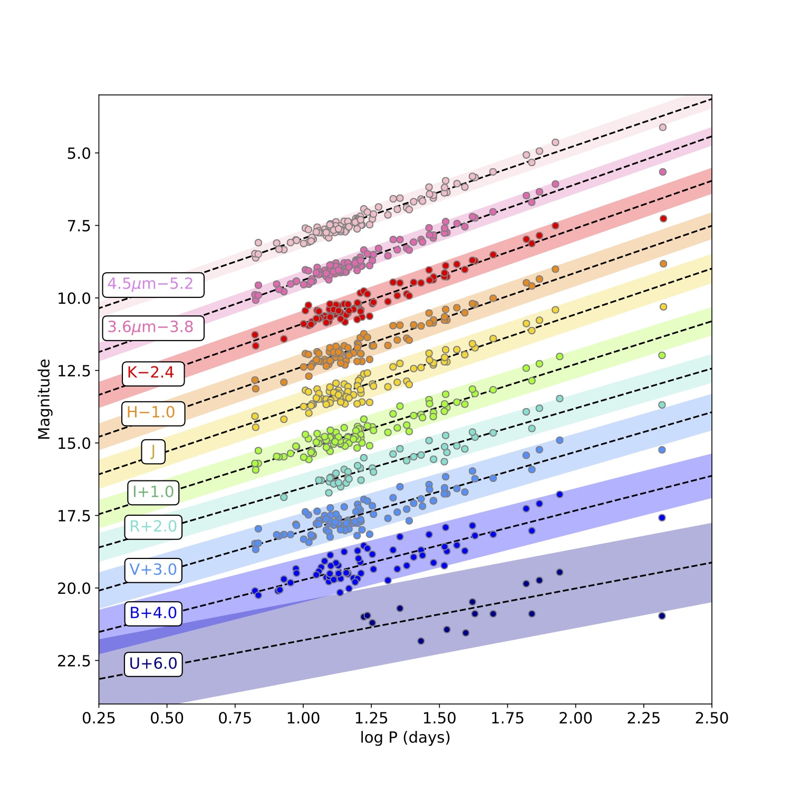
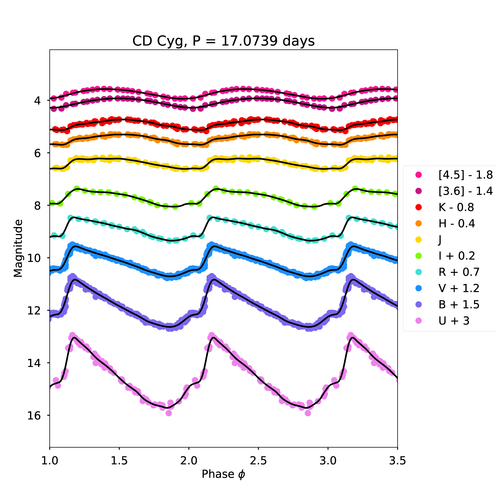
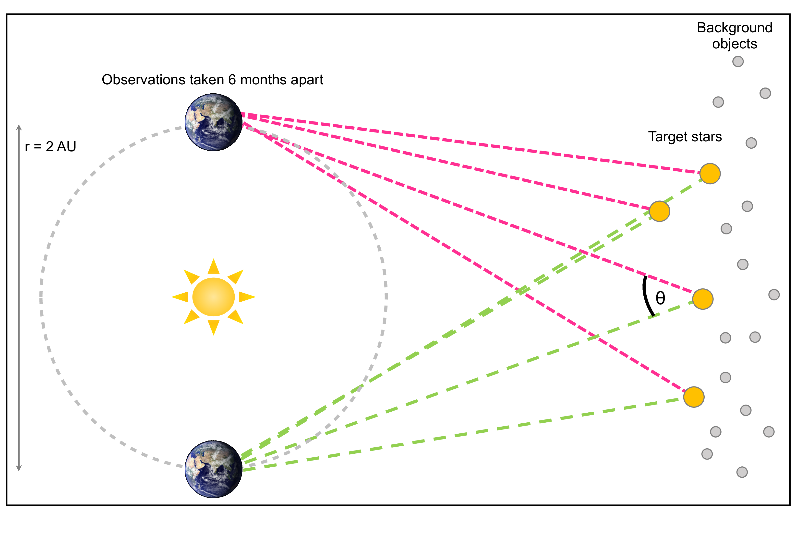
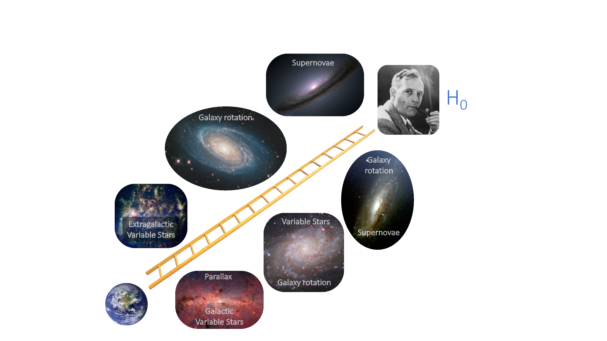
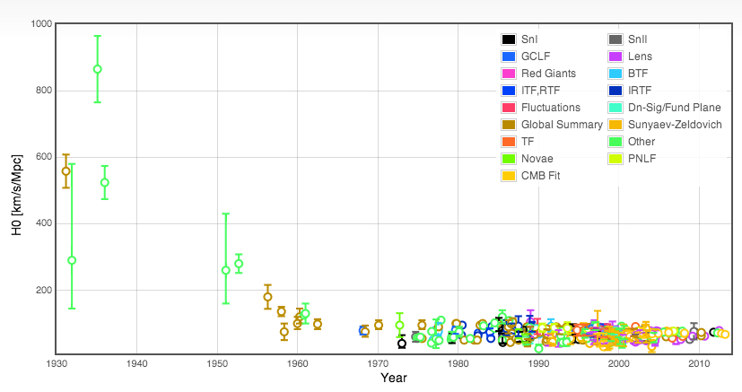
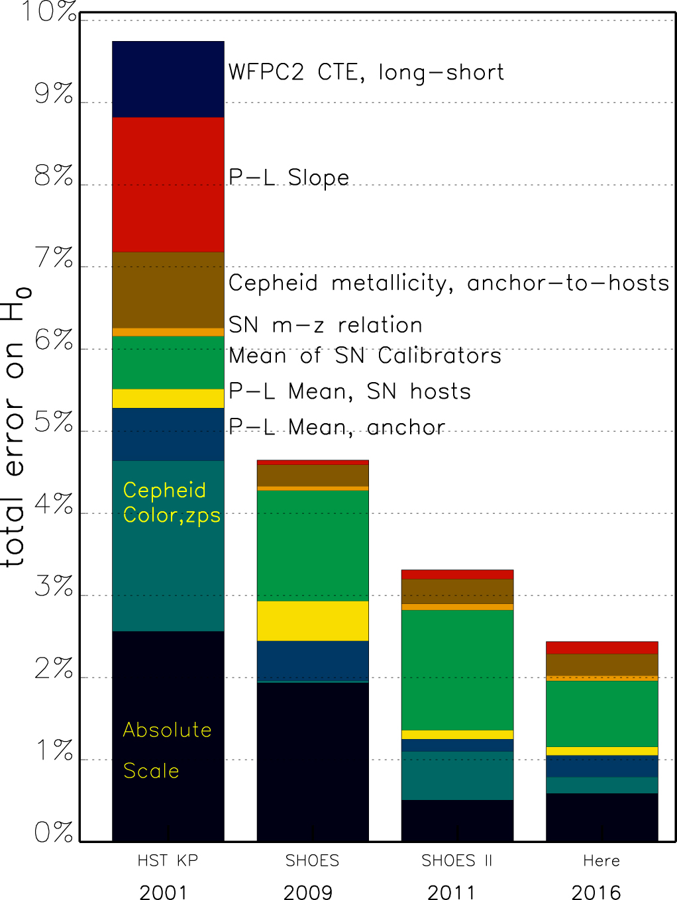
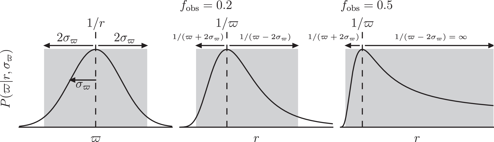

Observational Techniques: The Distance Ladder {#ch:obs-techs}
===================================

In Chapters \@ref(ch:eqs-of-expanding), \@ref(ch:constituents) and \@ref(ch:obs-params), we mainly considered the theoretical aspects of Cosmology. In this section we will investigate the link between the models that describe the expanding Universe and the observations that allow us to measure their parameters.

Equations to Observations {#sec:eq-to-obs}
--------------------------
As we have seen in the previous sections, the Friedman equation is the foundation of Cosmology:
\begin{equation}
    \left(\dfrac{\dot{a}}{a}\right)^2 + \dfrac{kc^2}{a^2} = \dfrac{8\pi G}{3}\rho
(\#eq:friedman-obs-chap)
\end{equation}

In Section \@ref(sec:matter-eos), we showed that the scale factor, $a$, evolves as
\begin{equation}
	a(t) = \left(\dfrac{t}{t_0}\right)^{2/3}
	(\#eq:a-t-obs)
\end{equation}
in a matter-dominated Universe, leading us to the Hubble parameter, $H(t)$:
\begin{equation}
H(t) \equiv \dfrac{\dot{a}}{a} = \dfrac{2}{3t}
(\#eq:ht-a-obs)
\end{equation}

An accurate and precise measurement of $H(t)$ will tell us how $a$ changes over time. Additionally, measuring $H(t_0)$, more commonly written as $H_0$ (the Hubble constant), gives us an estimate of the age of the Universe.

The longest established route for measuring $H_0$ is via the **distance ladder**. The distance ladder ties together various **standard candles** in order to estimate the distances of increasingly distant objects. 

Standard candle measurements of $H_0$ {#sec:standard-candle-h0}
--------------------------

Standard candles are astronomical objects of known intrinsic brightness. Examples of standard candles are objects such as type Ia supernovae, or Cepheid variable stars. 

Cepheids are standard candles as they have a well-defined relationship between their intrinsic brightness (or absolute magnitude) and their period of variation. This relation is known as the **Leavitt law** [@1912Leavitt], but you may also see it referred to as the period-luminosity relation. Figure \@ref(fig:smc-pls) shows the Leavitt laws for a selection of Cepheids in the Small Magellanic Cloud.

```{r echo=FALSE, smc-pls, out.width='100%', fig.show='hold', fig.cap='Leavitt laws for Cepheids in the Small Magellanic Cloud observed at optical (purple, bottom) to mid-infrared (pink, top) wavelengths. There is a clear relation between period and luminosity, with the relation tightening and steepening as we move to longer wavelengths. The relations are offset so these changes can be seen. Adapted from @2016Scowcroft.'}

```

By comparing the apparent magnitude of a standard candle with it's absolute magnitude we can obtain its distance:
\begin{equation}
	\mu = m - M = 5 \log(d) - 5
	(\#eq:distance-mod-1)
\end{equation}
where $\mu$ is the distance modulus, $m$ is the apparent magnitude, $M$ is the absolute magnitude, and $d$ is the distance in parsecs. In the case of Cepheids, we observe the star's apparent magnitude and calculate its absolute magnitude using the Leavitt law. The Leavitt law takes the form
\begin{equation}
	M_{\lambda} = a_{\lambda} \log(P) + b_{\lambda}
	(\#eq:leavitt-law)
\end{equation}
where $M_{\lambda}$ is the absolute magnitude at wavelength $\lambda$, and $a_{\lambda}$ and $b_{\lambda}$ are the slope and intercept of the relation. Figure \@ref(fig:smc-pls) shows how the slope ($a$) and intercept ($b$) change with wavelength, with $a$ becoming increasingly negative as we move to longer wavelengths. 

Moving to longer wavelengths to measure Cepheid distances is advantageous for several reasons. First, effects of reddening and extinction on apparent magnitudes are dramatically reduced compared to optical wavelengths. Second, the Leavitt law has smaller dispersion -- i.e. the standard deviation, $\sigma$ of the points around the Leavitt law is smaller, and the amplitude of their light curves are smaller (see Figure \@ref(fig:CDCyg). This means that distances obtained from redder wavelengths are more accurate than those from shorter wavelength observations. 

```{r echo=FALSE, CDCyg, out.width='80%', fig.show='hold', fig.cap='Multiwavelength light curves for Milky Way Cepheid CD Cyg. The light curves become more sinusoidal and smaller in amplitude as you move from blue to red wavelengths.'}

```

Calibration of standard candles {#sec:sc_calibration}
--------------------------

Standard candles are useful as they are objects of **known intrinsic luminosity**. But how do we know their intrinsic luminosity? To determine the intrinsic luminosity of a standard candle, we must have a **calibration sample** for which we know the objects distance in addition to their apparent magnitudes. In the case of variable stars, this is done using **parallax** measurements of objects within the Milky way.

Parallax calibration of standard candles {#sec:parallax}
-------------------------------
Parallax is a geometric distance determination. Distances are estimated by measuring how the positions of objects change over time with respect to a reference frame of distant, background objects. 

```{r echo=FALSE, parallax, out.width='100%', fig.show='hold', fig.cap="Schematic of the parallax method (not to scale). Distances are determined by measuring the apparent angular shift of nearby objects compared to an seemingly static background of distant objects. Observations are separated by six months (i.e. opposite sides of the Earth's orbit) in order to maximise the baseline of the observations."}

```

Figure \@ref(fig:parallax) illustrates how parallax distance determinations are made. The positions of target stars relative to distant, background objects are measured. Observations are separated by six months, in order to maximise the baseline of the observations. The parallax angle, $\varpi = \left(\theta / 2\right)$ is used to calculate the distance via simple trigonometry:

\begin{equation}
	d = \dfrac{r}{\tan(\varpi)}
	(\#eq:par-1)
\end{equation}

As the parallax angle, $\varpi$, is extremely small, and the baseline length is much smaller than the distance of the target object $\left(\text{i.e. }r \ll d \right)$, Eq. \@ref(eq:par-1) can be simplified to:

\begin{equation}
	d = \dfrac{1}{\varpi}
	(\#eq:par-2)
\end{equation}
where $d$ is the distance of the target in parsecs.

In the case of the distance ladder, parallax distances of Cepheids are used to fix the intercept, or zero-point, of the Leavitt law. Until recently only 10 Cepheids with high-precision parallaxes were available for this calibration. However, the *Gaia* mission promises to dramatically improve this situation. *Gaia* is a European Space Agency mission which is measuring the parallaxes of over *one billion* stars in the Milky Way and its nearest neighbours to extremely high precision. The precision of *Gaia* is such that if we put it on top of Buckingham Palace it could resolve a human hair on top of the Empire State Building, over 5,500 km away. *Gaia*'s parallax catalogue will contain many thousands of Cepheids that could potentially be included in the Leavitt law calibration. 

The Distance Ladder {#sec:distance-ladder}
-----------------
With the Leavitt law calibrated, we can now measure distances to objects outside of our own Galaxy. However, although Cepheids are bright stars, we cannot observe them in very distant galaxies. In order to measure distances to the furthest objects we must use different techniques, each calibrated to our parallax zero-point. Tying together different methods to estimate distances to progressively further objects is known as the **distance ladder**. Figure \@ref(fig:distance-ladder) shows how the techniques tie together to measure $H_0$.

```{r echo=FALSE, distance-ladder, out.width='100%', fig.show='hold', fig.cap="The distance ladder. The bottom rung of the distance ladder is established by measuring parallax distances to Cepheids within our own Galaxy. Cepheids are measured in increasingly distant galaxies in order to calibrate the absolute scale of techniques such as the Tully Fisher relation and Type Ia supernovae (SN Ia). The Hubble constant is measured using the recession velocities (redshift) and distances of SN Ia in the furthest galaxies, where contribution of peculiar velocities is minimized."}

```

To get an accurate measurement of $H_0$ we must use objects that are as far away as possible. If we were to use only galaxies that were nearby in our estimation then the velocities we measure would be dominated by **peculiar motions**. Peculiar motions are caused by gravitational interaction with other nearby objects. For very distant galaxies -- those deemed to be in the **Hubble flow** -- the galaxy's velocity is dominated by its **recession velocity**, and the contribution from the peculiar velocity is negligible. 

Measurements of $H_0$ from the distance ladder {#sec:ho_distance_ladder}
-----------
The distance ladder is one of the oldest and most frequently used techniques to measure $H_0$. Figure \@ref(fig:ho-distance-ladder) shows how our measurements of $H_0$ have converged over time, from the early measurements in the 1930's, to the high-precision measurements of the 2010's and 2020's. From Figure~\ref{fig:ho_distance_ladder} it looks like we may have reached a consensus on the value of $H_0$. To confirm that, we need to consider the uncertainties on our measurements. 

```{r echo=FALSE, ho-distance-ladder, out.width='100%', fig.show='hold', fig.cap="Measurements of $H_0$ as a function of time. Hubble's original measurement [1929Hubble] was around 500 km s$^{-1}$ Mpc$^{-1}$. Over the last one-hundred years, we appear to have reached a consensus that $H_{0}$ is approximately 70 km s$^{-1}$ Mpc$^{-1}$, although recent high precision measurements have brought that consensus into question."}

```

Uncertainties in the distance ladder {#sec:distance-ladder-uncertainties}
-----------
There are two types of uncertainties that can be present in a result -- **systematic** and **random**. A comparison of the two and their effects on the precision and accuracy of a measurement are shown in Table \@ref(tab:sys-vs-rand) and Figure \@ref(fig:sys-vs-rand). 

Table: (\#tab:sys-vs-rand) Comparison of systematic and random uncertainties

| Systematic | Random      | 
|:----------|----------:|
| Affects all data points the same way | Affects each point differently |
| |  Often assumed to have Gaussian distribution |
| Causes **offsets** | Causes **dispersion** |
| Affects **accuracy** | Affects **precision** |
| Doesn't decrease with $N_{\text{obs}}$ | Decreases with $\sqrt{N_{\text{obs}}}$ |


```{r echo=FALSE, sys-vs-rand, out.width='100%', fig.show='hold', fig.cap="The effect of systematic and random uncertainties on accuracy and precision."}
knitr::include_graphics("Images/precision_accuracy.png")
```

The distance ladder ties together several techniques to measure distances to the furthest galaxies, hence uncertainties on each "rung" of the ladder propagate through to our final measurements. Large uncertainties at the bottom will lead to unreliable measurements at the top, in a similar way to having an unstable foundation for the bottom of a ladder leads to an unstable, wobbly ladder that you really wouldn't want to stand at the top of. 

A major step forward in measuring a high-precision value of $H_0$ was made in 2001 with the publication of the results from the *HST Key Project to Measure the Hubble Constant* [2001Freedman], who found $H_0$ = 71~$\pm$~2~(rand.)~$\pm$~6~(sys.) km~s$^{-1}$~Mpc$^{-1}$. Table \@ref(tab:kp-errs) shows how different components of systematic uncertainty combine in their final result.

Table: (\#tab:kp-errs) Overall systematic uncertainties in the Hubble constant. From [@2001Freedman].


| Source of uncertainty | Method of estimation | Error (%) |
|:-----------------|:-------------------------------|------:|
| LMC zero point | Error on mean from Cepheids, TRGB, SN 1987A, red clump, eclipsing binaries | $\pm$  5 |
| *HST* camera calibration |	Tie-in to Galactic star clusters	| $\pm$ 3.5 |
| Reddening |	Limits from photometry |	$\pm$ 1 |
| Metallicity	| Observational and theoretical constraints | $\pm$ 4 |
| Bias in Leavitt law |	Short-end period cut-off |	$\pm$ 1 |
| Crowding |	Artificial star experiments	| +5, -0 |
| Large scale flows  |	Limits from SN Ia, CMB	| $\pm$ 5 |

In the years since the *HST* Key Project, these uncertainties have been further reduced. One of the highest precision measurements of $H_0$ to date comes from the *SH$_{0}$ES* experiment [@2016Riess], who found $H_0= 73.24 \pm 1.74$ km s$^{-1}$~Mpc$^{-1}$. Figure \@ref(fig:riess-errs) shows the breakdown of their uncertainty budget.  

```{r echo=FALSE, riess-errs, out.width='50%', fig.show='hold', fig.cap="Uncertainty budget from the *SH$_{0}$ES* experiment [@2016Riess]."}

```

One of the largest uncertainties remaining in distance ladder measurements of $H_0$ comes from the bottom rung of the ladder. In the Key Project, the ladder was tied to our nearest galaxy, the Large Magellanic Cloud (LMC). *SH$_{0}$ES* reduced this uncertainty by tying their calibration to the Cepheids in the LMC (which can all be assumed to be at the same distance), Cepheids with parallaxes in the Milky Way (MW), and Cepheids in the mega-maser host galaxy NGC4258.

:::fyi
Astrophysical masers are sources of stimulated microwave emission, similar to lasers. Mega-masers are astrophysical masers with very high isotropic luminosities. Mega-masers are excellent geometric distance indicators. By assuming that the maser is travelling round a galaxy with a Keplerian orbit we can calculate the intrinsic size of the system. Comparing this with its apparent size gives us an estimate of the distance.
:::

Until recently, only a handful of MW Cepheids had high-precision parallax measurements. The ESA *Gaia* mission will change this in the coming years by measuring high-precision parallaxes for over 1~billion stars in the MW. The *Gaia* sample will include several thousand Cepheids which can then be used to anchor the distance ladder. Figure \@ref(fig:gaia-sky) shows the sky as seen by *Gaia*. Each star in this image has a parallax measurement, including those in the Magellanic Clouds (seen to the bottom right of the Galactic Plane).

```{r echo=FALSE, gaia-sky, out.width='100%', fig.show='hold', fig.cap="The *Gaia* sky in colour. Credit: ESA/Gaia/DPAC, CC BY-SA 3.0 IGO."}
knitr::include_graphics("Images/Gaia_s_sky_in_colour.jpg")
```

In order to properly calibrate the Leavitt law and the uncertainties it contributes to the distance ladder, the *Gaia* Cepheid parallaxes must be treated extremely carefully. When using small samples of Cepheids with reasonably small uncertainties, it is appropriate to estimate the parallax distance ($r$) as
\begin{equation}
r = \dfrac{1}{\varpi}
(\#eq:gaia-1)
\end{equation}
where $\varpi$ is the parallax angle. However, if we wish to ensure an unbiased calibration of the Leavitt law, we must not truncate the Cepheid sample with limits on (a) parallax uncertainty ($\sigma_{\varpi}$) or (b) apparent magnitude. As there is an inverse relation between parallax and distance, the probability distribution of distances for a given parallax angle is skewed, becoming more so as the fractional uncertainty ${f}_{\mathrm{obs}} = \sigma_{\varpi}/\varpi$ increases. This is illustrated in Figure \@ref(fig:gaia-errs). 

```{r echo=FALSE, gaia-errs, out.width='100%', fig.show='hold', fig.cap='Left panel is the probability $P(\\varpi | r,{\\sigma }_{\\varpi })$ as a function of $\\varpi$. The middle panel is $P(\\varpi | r,{\\sigma }_{\\varpi })$ as a function of $r$ for an object with ${f}_{obs}=0.2$, and the right panel is as the middle panel but for ${f}_{obs}=0.5$, where. ${f}_{obs} = \\sigma_{\\varpi}/\\varpi$. The shaded areas indicate the 2$\\sigma$ credible interval about $1/r$ and the corresponding transformed credible interval. As $f_{obs}$ increases, the probability distribution for $r$ becomes more skewed, such that stars with larger parallax uncertainties become more likely to have overestimated $r$ than to have underestimated $r$. From @2016BJ'}

```

This skewness must be taken into account in order to prevent systematic uncertainties being introduced into the Leavitt law calibration. Therefore, rather than use the simple parallax equation given in Eq. \@ref(eq:gaia-1), we must use a full Bayesian analysis to estimate distances. A full discussion of the application of Bayesian statistics to parallax measurements is beyond the scope of this course. However, if you are interested in the methodology, the series of papers by Astraatmadja & Bailer-Jones gives an excellent introduction to the topic [@2015BJ; @2016BJ; @2016ABJ2].


