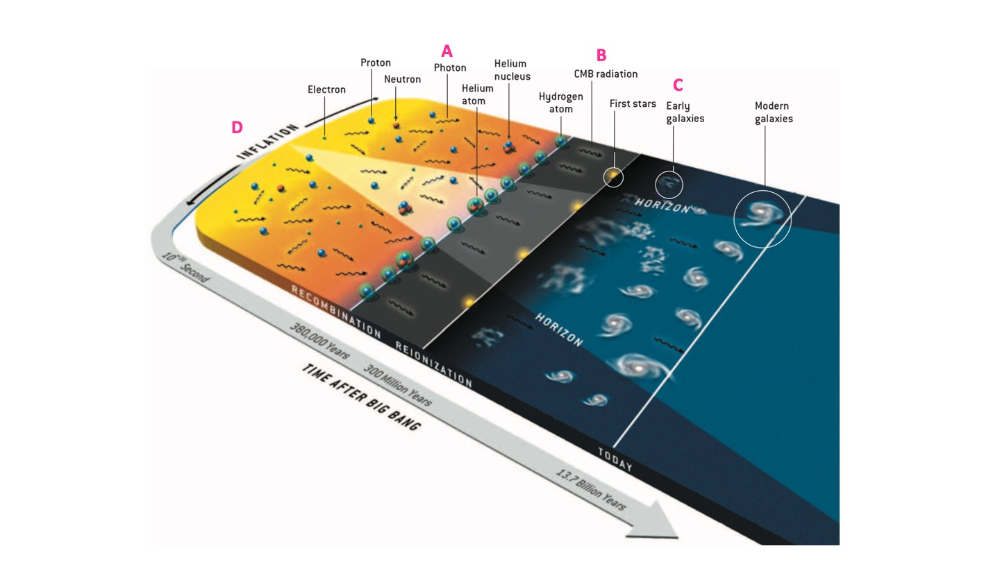
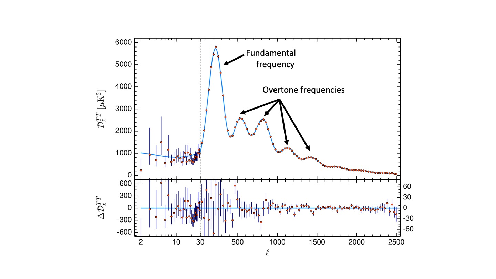
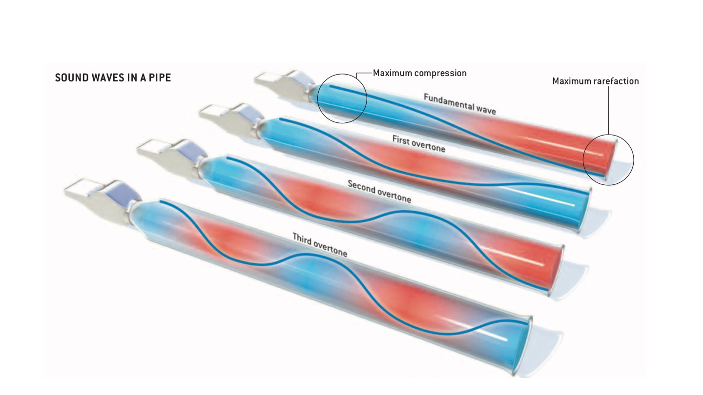
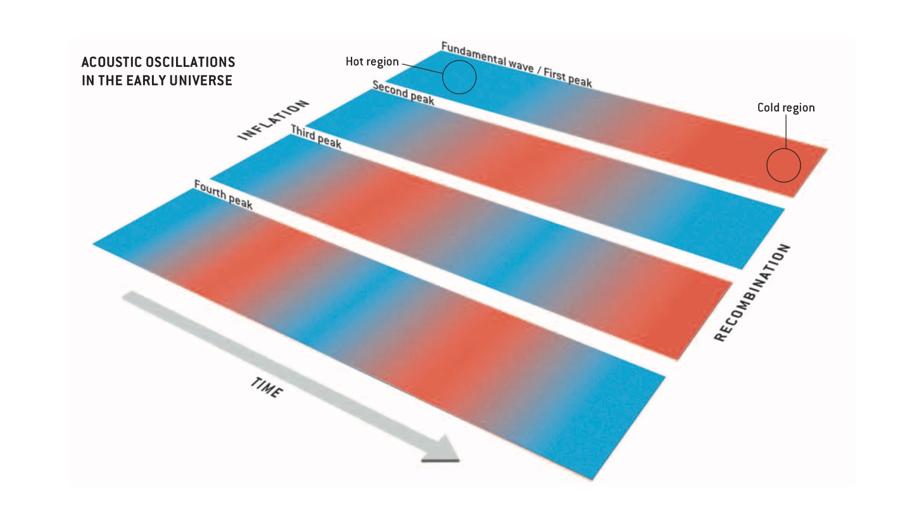
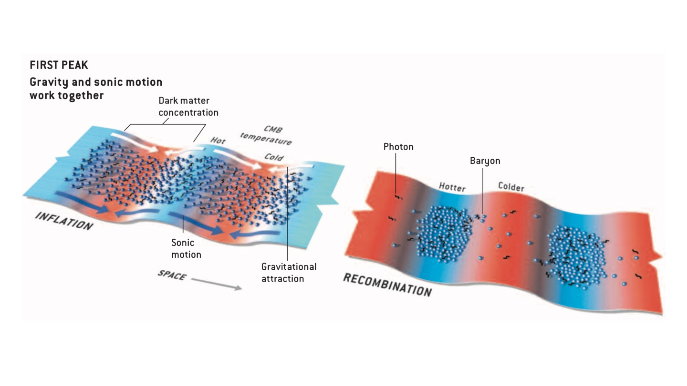
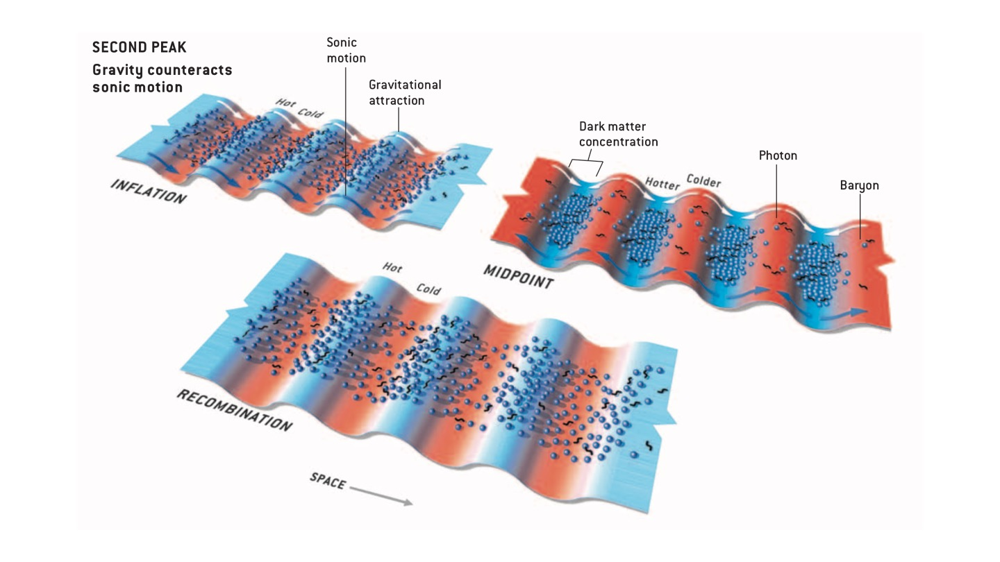

Observational Techniques: The Cosmic Microwave Background {#ch:obs-techs-cmb}
===================================

In Chapter \@ref(ch:obs-techs) we looked at the standard candle distance ladder. Like all experiments, measurements from the distance ladder contain both **systematic** and **random** uncertainties (see Sec. \@ref(sec:distance-ladder-uncertainties)). In order to determine whether our measurements of cosmological parameters are robust, we must use more than one technique to measure them. In this Chapter, we will look at **standard rulers**, and how the **Cosmic Microwave Background** (CMB) can be used to make independent and complementary measurements of the cosmological model.

Standard Candles vs Standard Rulers {#sec:candles-vs-rulers}
------------

Standard rulers are similar to standard candles in that they have a known intrinsic property. Standard rulers are objects with known **intrinsic physical size**. By measuring the apparent (angular) size of an object and comparing to its actual physical size, we can calculate the distance of the object in question. Table \@ref(tab:candle-vs-ruler) shows a comparison of the standard candle and standard ruler techniques. 

Table: (\#tab:candle-vs-ruler) Comparison of standard candles and standard rulers

| Standard Candles | Standard Rulers      | 
|:----------|----------:|
| Objects of **known intrinsic luminosity** | Objects of **known physical size** |
| Compare apparent and absolute **brightness** to determine distance | Compare apparent to actual **size** to measure distance | 
| Build up ladder from **nearest to furthest** objects to estimate $H_0$ | **"Reverse distance ladder"** -- measuring $H(z)$ and extrapolating to $H_0$|

A key point to take away from Table \@ref(tab:candle-vs-ruler) is the different methods used to estimate $H_0$. The standard candle distance ladder builds up in the way you would expect -- starting with the nearest objects as calibrators, gradually building up to more and more distant objects to eventually determine $H_0$. Standard rulers, however, use a **reverse distance ladder** which does not directly measure $H_0$. Instead, measurements are made of $H(z)$ (the Hubble parameter at redshift $z$), and a cosmological model is used to infer the value of $H_0$. 

The great strength of this approach is that it is independent of the measurements that have gone into the distance ladder. The results of the standard candle experiments can provide independent verification of the results from standard ruler experiments. The main drawback, however, is that measurements of e.g. $H_0$ are dependent on the cosmological model used. We will review the strengths and limitations of the different techniques in a later section.

The most well-known standard ruler in astronomy is perhaps the Cosmic Microwave Background. In this Chapter we will investigate the formation of the CMB, and how we can derive cosmological parameters from CMB measurements. 

What is the Cosmic Microwave Background {#sec:cmb}
-------------

The Cosmic Microwave Background can be thought of as the radiation "left over" from the Big Bang. First detected by Penzias and Wilson in 1965, the CMB is seen over the whole sky has a black-body spectra that peaks at $T$ = 2.726 K. Figure \@ref(fig:planck) shows the Cosmic Microwave Background observed by the *Planck* satellite. Although you can see fluctuation in Fig. \@ref(fig:planck), these variations are very small. The CMB is incredibly flat with temperature variations of the order of around $\frac{\Delta T}{T} = 10^{-5}$. To put this into perspective, if the water in a regular swimming pool was as flat as the CMB, the ripples on the surface would be less than 10 $\mu$m high!


```{r echo=FALSE, planck, out.width='100%', fig.show='hold', fig.cap="The Cosmic Microwave Background observed by *Planck*. Credit: *Planck* Legacy Release 2018, ESA and the *Planck* collaboration."}
knitr::include_graphics("Images/CMB2018_Planck_4672.jpg")
```
How did the CMB form? {#sec:cmb-formation}
------------------
:::fyi
The images in the section come from the excellent review article **['The Cosmic Symphony'](http://background.uchicago.edu/~whu/Papers/HuWhi04.pdf)** by Wayne Hu and Martin White. The notes for this chapter should be used alongside the **@CosSymp** article, and Wayne Hu's  **[beginner](http://background.uchicago.edu/~whu/beginners/introduction.html)** and **[intermediate](http://background.uchicago.edu/~whu/intermediate/intermediate.html)** CMB tutorials. 
:::

```{r echo=FALSE, cmb-labelled, out.width='100%', fig.show='hold', fig.cap="The formation of the CMB. From @CosSymp."}

```
Very early on in the Universe's evolution, the matter and radiation were coupled (region **A** on Fig. \@ref(fig:cmb-labelled)). The protons, electrons, and photons behaved as a single plasma, with photons scattered by the electrons. At this time any small fluctuations in the density of the plasma propagated through it like sound waves. Like any other plasma, compression resulted in heating, and rarefaction resulted in cooling of the plasma. 

Approximately 370,000 years after the Big Bang (region **B** on Fig. \@ref(fig:cmb-labelled)) the Universe had expanded (hence cooled) sufficiently that the protons could capture the electrons to form neutral Hydrogen. This process is known as **recombination**. As the photons were no longer scattering off free electrons, they were able to travel throughout the Universe. Photons that originated from the hotter, denser regions had higher energy, while those from the cooler, less dense regions had lower energies. This pattern of hot and cold fluctuations was then frozen into the CMB. 

It was not only the CMB photons that these density variations affected. As the Universe expands and cools further, gravitational attraction causes matter to condense in the denser regions of the Universe. This leads to the formation of the first stars and galaxies (region **C** on Fig. \@ref(fig:cmb-labelled)). 

Where do the fluctuations come from? {#sec:cmb-fluctuations}
------------------

In Sec. \@ref(sec:cmb-formation) we saw that there are fluctuations in the "plasma" of protons, electrons, and photons that permeates the early Universe. But where do these fluctuations come from? The Cosmological principle tells us that the Universe should be homogeneous and isotropic, so why is this plasma not completely flat?

The answer comes from one of the strangest stages of the Universe's evolution -- **inflation** (region **D** on Fig. \@ref(fig:cmb-labelled)). We believe that in the *very* early Universe ($t < 10^{-32}~s)$ since the Big Bang) that the Universe was permeated by an "inflation field" that caused it to expand faster than the speed of light, $c$. During the inflationary period, there were quantum fluctuations in the field which caused the variations in density seen later on. These quantum fluctuations were extremely small at the time (as quantum fluctuations tend to be...), but they were amplified by the rapid expansion of the Universe.

This all sounds quite far-fetched (even for Cosmologists), but there is observational evidence that inflation occurred in the very early Universe. Firstly, we observe that these fluctuations are approximately equal on all scales, adding weight to the quantum fluctuations explanation. Secondly, we see that the "sound waves" frozen into the CMB are all in phase with each other. This tells us that they must have all been created at the same time. 

We will return to mysteries and evidence for inflation in a later section of the course. For now, the key point to take away is that the density variations in the early Universe were caused by quantum fluctuations in the inflationary field that were amplified by the rapid expansion. 

Analysing the CMB {#sec:cmb-analysis}
------------------

To get at the tasty cosmological parameters hidden in maps of the CMB like the one in Fig. \@ref(fig:planck) we have to transform the images into something more useful. The main tool in CMB analysis is the **power spectrum**. Figure \@ref(fig:power-spec-1) (adapted from @Planck18) is the angular power spectrum of the CMB from the *Planck* mission. 

```{r echo=FALSE, power-spec-1, out.width='100%', fig.show='hold', fig.cap="The angular power spectrum of the CMB. The first peak corresponds to the fundamental frequency, with the lower amplitude peaks corresponding to overtone frequencies. Adapted from @Planck18."}

```

The power spectrum shown in Figure \@ref(fig:power-spec-1) has several peaks, each corresponding to a different mode of the waves in the CMB. The relative positions and amplitudes of these peaks can tell us about the physical processes and conditions in the early Universe. Before we look at what exactly the power spectrum tells us, we'll look in more detail at what's actually going on in these "waves".

Continuing our analogy of thinking of the density fluctuations as sound waves, we can relate how a sound wave propagates through a pipe to what's happening in the Universe. Figure \@ref(fig:pipe) shows us how the air is compressed and rarefied as a sound wave moves through an open pipe.

```{r echo=FALSE, pipe, out.width='100%', fig.show='hold', fig.cap="The propagation of a sound wave through an open pipe. Blue regions correspond to regions where the air is compressed, red regions correspond to regions where it is rarefied. From @CosSymp."}

```

The top pipe in Fig. \@ref(fig:pipe) shows the fundamental mode of the wave. There is maximum compression of the air at the end that you blow in to, and minimum compression (maximum rarefaction) at the other end. For the overtone frequencies there are multiple regions of maximum and minimum compression, with the number of each dependent on the wave's mode. For example, if the wave was oscillating in the first overtone frequency, there would be two regions of maximum compression, and one of minimum compression. For a second overtone wave, there are two of each. 

Figure \@ref(fig:cmb-waves) demonstrates the same effect in the plasma in the early Universe. Regions were compressed (blue) and rarefied (red). This compression and rarefaction resulted in temperature changes in the CMB photons, so that at the time of recombination photons that originated from the compressed regions had higher temperatures (hence energies) than those originating from the less dense regions. 

```{r echo=FALSE, cmb-waves, out.width='100%', fig.show='hold', fig.cap="Oscillations in the early Universe plasma. Blue regions are denser and have higher temperatures, resulting in higher energy photons than those in the less dense red regions. From @CosSymp."}

```

We can see now where the variations in the CMB and the peaks in the power spectrum originate from. However, you may be asking yourself an important question at this point. In Sec. \@ref(sec:cmb-fluctuations) we said that the fluctuations are approximately equal on all scales. So why aren't all the peaks in Fig. \@ref(fig:planck) the same height? The answer to this comes again from the nature of sound waves.

A sound wave of a given wavelength can only propagate if it travels over a distance that is longer than it's wavelength. This means that any fluctuations with wavelengths smaller than the distance travelled will dissipate. The density of the plasma in the early Universe was such that a particle could typically travel around 3 kpc before it interacted with something else, and waves shorter than about 10 times this length (i.e. 30 kpc) would be damped. Since the epoch of recombination, the Universe has expanded by a factor of approximately 1000, meaning that any waves on a scale below 30 Mpc in today's Universe would be damped. 

::: fyi
**Wavelengths and wavelengths**
In the discussion above, the "wavelengths" referred to are the density waves in the plasma. This is not the same as the wavelength of the CMB photons. The CMB photons have microwave wavelengths, not Mpc scale wavelengths.
:::


Interpreting the power spectrum {#sec:cmb-interpretation}
------------------

Now we understand the origin of the CMB fluctuations, we can investigate how changes to the cosmological parameters will be reflected by changes in the power spectrum. 

Figure \@ref(fig:peak1) shows the physical processes behind the first peak in the power spectrum.

```{r echo=FALSE, peak1, out.width='100%', fig.show='hold', fig.cap="The first peak of the CMB power spectrum. The left hand figure shows the distributions of dark matter and temperature at the end of inflation. The right hand figure shows the dark matter and temperature distributions at the epoch of recombination. From @CosSymp."}

```

On the left hand side of Fig. \@ref(fig:peak1) we see the distribution of dark matter, baryons, and the CMB temperature at the end of the inflationary period. As dark matter *only* interacts via gravity, it concentrates into the potential energy troughs (the dips in \@ref(fig:peak1)) on the same scale as the fundamental wave in the plasma. These concentrations of dark matter **increase** the depth of the potential well, attracting baryons and photons in there with them. As the photons would now lose more energy escaping these deeper potential wells, known as the **Sachs-Wolfe effect**, these regions correspond to colder photons. 

The right hand side of Fig. \@ref(fig:peak1) shows the distributions of baryons and temperature at the time of recombination. By this point, gravity (which acts on both the baryons and the dark matter) and the sonic motion of the waves (which acts only on the baryons) have worked together to increase the temperature of the photons in the potential energy troughs and lower the temperature in the peaks. Matter is still condensed in the potential energy troughs, but these regions now correspond to hot regions in the CMB.

```{r echo=FALSE, peak2, out.width='100%', fig.show='hold', fig.cap="The second peak of the CMB power spectrum. For the second (and higher order) peaks, the effects of gravity and sonic motion can counteract each other. The top left figure shows that the forces act in a similar way to the fundamental peak initially. However, the top right figure shows us that, well before the epoch of recombination, the increase in temperature in the potential energy troughs results in an increase in radiation pressure. This pushes photons out of the potential well, while baryons are still being drawn in. By recombination, these forces have decreased the amplitude of the potential, resulting in a smoother potential energy (and hence temperature) distribution. From @CosSymp."}

```

Figure \@ref(fig:peak2) shows the forces affecting the second peak of the CMB power spectrum. For the second (and higher order) peaks, the effects of gravity and sonic motion can counteract each other. The top left figure shows that the forces act in a similar way to the fundamental peak initially. However, the top right figure shows us that, well before the epoch of recombination, the increase in temperature in the potential energy troughs results in an increase in radiation pressure. This pushes photons out of the potential well, while baryons are still being drawn in. By recombination, these forces have decreased the amplitude of the potential, resulting in a smoother potential energy (and hence temperature) distribution. The result is that the temperature differences are smaller in the second (and higher) order peaks of the CMB power spectrum. 

As discussed in Section \@ref(sec:candles-vs-rulers), estimates of parameters such as $H_0$ from the CMB depend on the cosmological model we assume. We can derive some cosmological parameters by analysing the power spectrum as we understand how they affect the locations and heights of the peaks.

:::fyi
This is a good time to take a look at Wayne Hu's **[intermediate](http://background.uchicago.edu/~whu/intermediate/intermediate.html) CMB tutorial**. The animations showing how changing cosmological parameters affect the observed power spectrum are really useful.
:::

The position of the first peak of the power spectrum (Fig. \@ref(fig:power-spec-1)) is influenced by the curvature of the Universe, $k$. As $k$ decreases, the first peak in Fig. \@ref(fig:power-spec-1) moves to the right. We know from Sec. \@ref(sec:metric) that changing $k$ changes the Robertson-Walker metric. Two objects in a Universe with $k = 0$ will have a different physical separation $ds$ (hence be subject to a different gravitational force) than two objects with the same $(r, \theta, \phi)$ coordinates in a $k=1$ Universe. This is why the position of the first peak moves as we change $k$.

The relative heights of the odd and even peaks in the power spectrum are affected by a process called **baryon loading**. Increasing the fraction of baryons in the Universe (i.e. increasing $\Omega_{b}) increases the heights of the odd peaks relative to the heights of the even peaks. 

Another important effect is **radiation driving**. If the radiation energy density dominates over the matter energy density, then the baryon-photon plasma will not be oscillating in a fixed potential well. The potential decays, driving up the amplitudes of the peaks in the power spectrum.

We can estimate cosmological parameters by taking all these effects, and multiple peaks, into account. For example, if the dark matter density ($\Omega_{dm}$) is increased, the radiation driving effect is reduced. Conversely, if $\Omega_{dm}$ is decreased, the effects of baryon loading are reduced. These effects will change all the peaks in the power spectrum. By considering (at least) the first three peaks, we can disentangle the different effects and break degeneracies between the effects of baryonic and dark matter. 

*Planck* results {#sec:planck-results}
------------------

Figure \@ref(fig:power-spec-1) shows the *Planck* power spectrum. Now we understand how to interpret it, we can look at the results that came out of the *Planck* mission. Figure \@ref(fig:planck-res) shows a selection of the cosmological parameters derived in @Planck18 and their relationship to each other. Table \@ref(tab:planck-res) shows the best fit values for the @Planck18 cosmological parameters.

```{r echo=FALSE, planck-res, out.width='100%', fig.show='hold', fig.cap="Results from @Planck18. The different coloured ellipses represent different analyses of the data. Grey, red, and blue represent the results using only *Planck* data, with green ellipses combining the *Planck* data with results from Baryon Acoustic Oscillations (BAO) experiments."}
knitr::include_graphics("Images/planck-res.jpg")
```
Table: (\#tab:planck-res) Selection of results from @Planck18 (table 1).

| Parameter | @Planck18 best fit value      | 
|:----------|----------:|
| $\Omega_{b}h^2$ | 0.02233 $\pm$ 0.00015 |
| $\Omega_{c}h^2$ | 0.1198 $\pm$ 0.0012100| 
| $\Omega_{m}h^2$ | 0.1428 $\pm$ 0.0011 |
| $H_0$ (km s$^{−1}$ Mpc$^{−1}$) | 67.37 $\pm$ 0.54 | 
| $\Omega_{m}$ | 0.3147 $\pm$ 0.0074 | 
| Age (Gyr) | 13.801 $\pm$ 0.024 | 

You are not expected to memorise the values of the cosmological parameters. In an upcoming session, we will compare results from different (complementary) experiments to assess just how much we really understand about the cosmological model. The key point to take away from this subsection is that there are interdependencies and degeneracies between the parameters, and that one experiment cannot give us all the answers.
