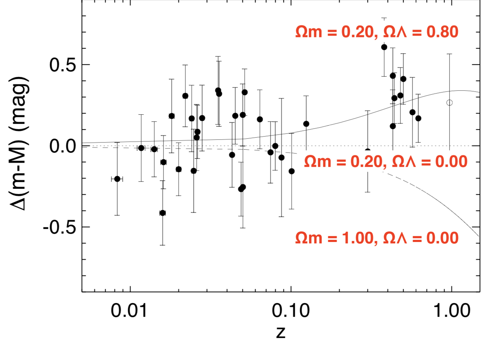

$\Lambda$CDM: The Standard Cosmological Model  {#ch:lambdacdm}
===================================

<!-- your comment 
* What are cosmological models?
* How does what we have done so far fit into a cosmological model?
* Hubble law
* Expansion etc
* Fate of the Universe under different assumptions:
 - different compositions
 - different curvatures
 * lambda CDM
  - what is it?
  - parameters?
* what evidence do we have for lcdm?
* What are the problems with lcdm?
-->

What is $\Lambda$CDM? {#sec:what-is-lcdm}
-------------------
Observations the cosmic microwave background (CMB, Ch. \@ref(ch:obs-techs-cmb), and those taken in distance ladder experiments (Ch. \@ref(ch:obs-techs)) can tell us things about the Universe such as:
 
 - that it is expanding,
 - its geometrical properties,
 - its age,
 - its composition,
 - how it started,
 - and how it ultimately may end.
 
 We can combine this knowledge into a **cosmological model**. The standard cosmological model is known as **$\Lambda$CDM**. Two of the key features of this model are given in it's name: It assumes that the Universe has a component of its energy density driven by the **cosmological constant, $\Lambda$**, and that dark matter is **cold dark matter (CDM)**.
 
 The cosmological constant term is believed to be due to **dark energy**.
 
 Cold dark matter refers to dark matter particles that have **non-relativistic** velocities. 
 
 What evidence do we have? {#sec:what-evidence}
-------------------
The features of the $\Lambda$CDM model are supported by observational evidence (as is the case with all good physical models!). We will now look at the evidence that supports several of the key features of $\Lambda$CDM.

### Expansion of the Universe {#sec:expansion-evidence}
$\Lambda$CDM assumes that the Universe is expanding. The evidence supporting this is possibly one of the earliest to be confirmed, with Hubble's first measurements in the 1920s, and increasingly precise measurements of the rate of expansion in the following century. 

The top panel of Figure \@ref(fig:riess-lambda) is the Hubble diagram from @Riess1998, showing the distance modulus as a function of redshift for a sample of supernova host galaxies (see Sec. \@ref(sec:standard-candle-h0) and Eq. \@ref(eq:distance-mod-1) for the relation between distance modulus and distance). The more distant objects in the sample are moving away from us faster than the closer objects, showing that the Universe is expanding. 

 ```{r echo=FALSE, riess-lambda, out.width='80%', fig.show='hold', fig.cap="Top panel: Hubble diagram showing distance as a function of redshift for a sample of supernova host galaxies. Bottom panel: Here $\\Delta(m-M)$ represents the difference in distance modulus from a model assuming no dark energy contribution $(\\Omega_{\\Lambda} = 0.00)$. The model that best fits the observed data has $\\Omega_m = 0.20$ and $\\Omega_{\\Lambda} = 0.80$, showing a significant dark energy contribution. From @Riess1998."}
knitr::include_graphics("Images/riess-lambda.jpg")
```
### Geometry of the Universe {#sec:geometry-evidence}
Theory suggest that we live in a 'flat' Universe. Observations from the CMB provide strong evidence that the Universe is flat. **However, they do not prove that the Universe is precisely flat, i.e. $k=0$.**. The observational evidence we do have shows that $k$ must be very, very, very close to zero, but we cannot prove that $k \equiv 0$. 

We will revisit the flatness problem at a later point, but for now we will assume that $k=0$. 

### Age of the Universe {#sec:age-evidence}

We can estimate the age of the Universe from different independent sources.

Globular clusters are contain the oldest stars in the Universe. We can use our knowledge of stellar evolution to determine the ages of these stars to get a lower limit to the age of the Universe.

Measurements of the CMB can also help us to estimate the Universe's age. When we include $\Lambda$ in CMB modelling and analysis, we find an age of the Universe that is consistent with other estimates such as the age of globular clusters.

However, this consistency is relatively new (cosmologically speaking...). In the 1980s (or thereabouts), the ages that were calculated for stars in globular clusters were much less robust and stellar evolution models produced stars that were older than the Universe itself! This is often referred to as the **cosmological paradox**. This was resolved by the *Hipparcos* satellite (*Gaia's* predecessor), that provided better measurements of stars in the Milky way, which resulted in improvements in the population synthesis models for globular clusters, decreasing their ages. 

Similarly, including $\Lambda$ in cosmological models reduced the discrepancy. Including $\Lambda$ in the Universe's energy density increased the age of the Universe. 

As $\Lambda increased the age of the Universe and the estimated ages of globular clusters were reduced, the oldest stars were now younger than the the age of the Universe. The cosmological paradox was solved, and the stellar modellers could sleep soundly once again. This shows why we need **independent** measurements of cosmological parameters to truly believe our results. 

### Composition of the Universe {#sec:composition-evidence}

As we saw in Ch. \@ref(ch:obs-techs-cmb), observations of the CMB can provide important information about the composition of the Universe, such as the density of dark matter. Some of the earliest evidence for dark matter came from **galaxy rotation curves**. Observations of galaxy rotation curves made by Vera Rubin showed that there must be 'missing' making the outskirts of galaxies rotate faster than predicted by their visible matter alone. 

Table \@ref(tab:composition) summarises our current understanding of the Universe's composition.

Table: (\#tab:composition) Fractional contributions of each component to the Universe's energy density. 

| Component | Evidence     | Value |
|:----------|:----------|----------:|
| Radiation | CMB temperature | $\Omega_{rad} = 2.47 \times 10^{-5}$ |
| Relativistic particles and photons | Cosmic neutrino background (theory) | $\Omega_{rel} = 4 \times 10^{-5}$ |
| Baryons | Nucleosynthesis predictions and CMB | $\Omega_{b} = 0.05$ |
| Cold dark matter | CMB measurements | $\Omega_{b} = 0.27$ | 
| Cosmological constant | Acceleration | $\Omega_{\Lambda} = 0.68$ | 

### Early history of the Universe {#sec:early-evidence}

It is impossible for us to study the initial conditions of the Universe. The earliest time that it would be physically possible make measurements of is approximately $10^{-43}$ seconds after the big bang. This is known as the **Planck time**. At scales below the Planck time, the effects of quantum gravity are likely to be important. 

In Sec. \@ref(sec:first_second) we looked at what happened in the first second of the Universe's evolution. Around $10^{-32}$ seconds after the big bang, we believe that the Universe underwent a period of inflation. The observational evidence for inflation comes (somewhat indirectly) from the CMB. The sizes of the fluctuations in the CMB and of features in the large scale structure of the Universe (e.g. clusters of galaxies) agree with the predictions from the theory of inflation. So while we cannot directly observe the inflationary period, we can see the evidence it left behind. 

### Fate of the Universe {#sec:fate-evidence}

In Sections \@ref(sec:dark-energy-1)  and \@ref(sec:lambda-obs-params) we saw that a Universe dominated by a cosmological constant will expand forever. We have observational evidence that this is currently the case.

Figure. \@ref(fig:riess-lambda-2) (the same as the bottom panel in Fig \@ref(fig:riess-lambda) shows how different cosmological models fit to observations of supernovae. 

```{r echo=FALSE, riess-lambda-2, out.width='80%', fig.show='hold', fig.cap="Here $\\Delta(m-M)$ represents the difference in distance modulus from a model assuming no dark energy contribution $(\\Omega_{\\Lambda} = 0.00)$. The model that best fits the observed data has $\\Omega_m = 0.20$ and $\\Omega_{\\Lambda} = 0.80$, showing a significant dark energy contribution. Adapted from @Riess1998."}

```

The data from @Riess1998 (and many subsequent experiments) show that the model that best fits the data is one where there is a significant contribution from a cosmological constant. Assuming that $\Lambda$ continues to dominate the energy density, the Universe should expand forever and an increasingly fast rate.

However, these experiments do not rule out any **unknown unknowns**. In the same way that we didn't know that dark energy was the dominant term 25 years ago, it may be that something else that we haven't predicted that dominates the energy density in the future. 

Assumptions and Interpretation {#sec:assumptions}
----------------

We can combine the evidence from all our experiments, e.g. *Planck* CMB observations, supernova experiments, etc., to build our cosmological model. 

Table \@ref(tab:planck-model) gives a selection of the key parameters in the base $\Lambda$CDM model from @Planck18. We've come across several of these before, such as the energy densities, $\Omega$, and the Hubble constant $H_0$. There are a couple of new ones here though.

Table: (\#tab:planck-model) Base $\Lambda$CDM cosmological parameters from @Planck18. 

| Parameter | Best fit value     | Uncertainty |
|:--------------------|----------:|----------:|
| $\Omega_{b}h^2$ | 0.02233 | 0.00015 |
| $\Omega_{c}h^2$ | 0.1198 | 0.0012 |
| $\Omega_{m}h^2$ | 0.1428 | 0.0011 |
| $H_0$ | 67.37 | 0.54 |
| $\Omega_{m}$ | 0.3147 | 0.0074 |
| Age (Gyr) | 13.801 | 0.024 | 
| $z_{re}$ | 7.64 |  0.74 | 
| 100$\theta_{*}$ | 1.04108 | 0.00031 | 

$z_{re}$ is the redshift at the time of recombination. $\theta_{*}$  is the acoustic scale, defined as
\begin{equation}
\theta_{*}  = \dfrac{r_{*}}{D_m}
(\#eq:theta-star-1)
\end{equation}
where $r_{*}$ is the sound horizon at the time of recombination, and $D_m$ is the comoving angular diameter distance, given by
\begin{equation}
D_m  = \dfrac{a_0 r_0}{(1+z)}
(\#eq:theta-star-2)
\end{equation}

The nature of these analyses is that many parameters are dependent on the others. Of the parameters in Table \@ref(tab:planck-model), only the first two, $\Omega_{b}h^2$ and $\Omega_{c}h^2$, are modelled directly. The other parameters are all dependent on these (plus some additional parameters that I haven't included -- if you're interested you can take a look at Table 1 in @Planck18). 

The implication of this is that the value of, say, $H_0$ that comes out of this analysis depends on the other parameters and any assumptions that are included. Two key assumptions that go into the $\Lambda$CDM model are that the **Universe is flat**, and that the dark energy equation of state parameter **w=-1**. It is possible to allow $k$ and $w$ to be free parameters in the cosmological model (known as an extended model). The results and implications of this will be covered in a later session. 


