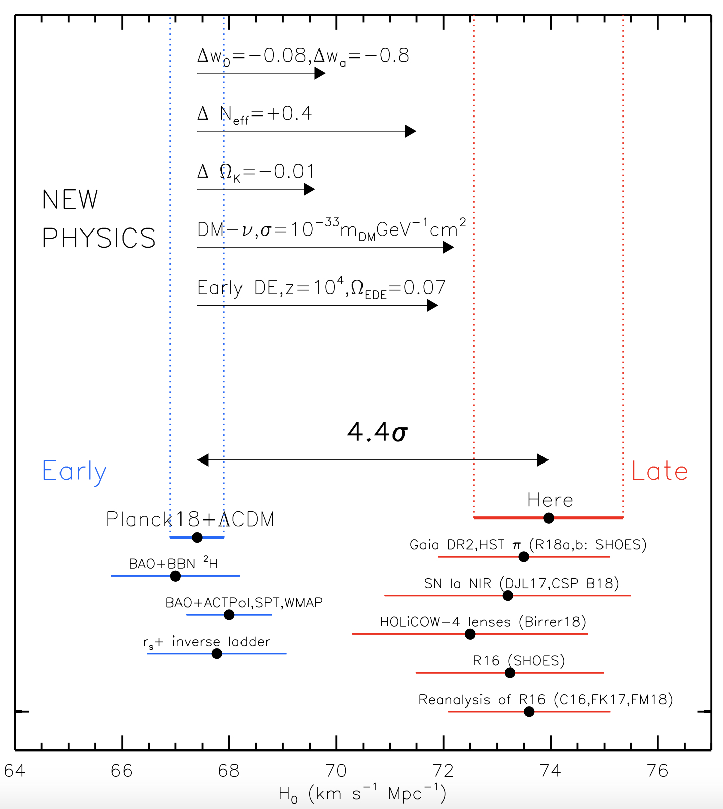

Current Research {#ch:current-research}
===================================

**IGNORE THIS SECTION FOR NOW.** 


In this section we will look at three recent experiments to measure the Hubble constant, $H_0$. Each experiment uses a different technique that is independent and complementary to the others. We will not be going into the technical details of each experiment here, but you are welcome to look at the original papers if you wish to learn more.

Under normal circumstances this part of the course would have been a discussion session, with each of you reading one of the three papers and discussing it in a group. As the format has been changed, you are not expected to read the papers, but you are expected to understand the main points that are summarised in this chapter. 

How to read a scientific paper {#sec:how-to-read}
------------------

When reading any scientific paper, there are several key questions you should keep in mind. 

* What is the technique being used in this paper? How does it work?
* How does the technique relate to other techniques you know about? 
* What is the main result of the paper? 
* What are the possible uncertainties in the experiment? How well are they understood?
* Which parameters are constrained by the experiment, and which are assumed?
* What (if any) improvements are suggested to better constrain their results?

These are the same questions you should be able to answer for each of the experiments in this section. I've done some of the hard work for you here by summarising the key results, but you'll get the most out of this section if you make your own comparisons between them and try to come to your own conclusions.

Experiment A: The standard candle experiment {#sec:candle-paper}
-----------

**Large Magellanic Cloud Cepheid Standards Provide a 1\% Foundation for the Determination of the Hubble Constant and Stronger Evidence for Physics Beyond $\Lambda$CDM**, @Riess2019

[https://ui.adsabs.harvard.edu/abs/2019ApJ...876...85R/abstract](https://ui.adsabs.harvard.edu/abs/2019ApJ...876...85R/abstract)

[Click here for paper pdf](Riess\_2019\_ApJ\_876\_85.pdf)

In this experiment, @Riess2019 use Cepheids in the Large Magellanic Cloud (our nearest galaxy) to improve their measurement of $H_0$. The use the distance ladder technique (Sec. \@ref(sec:distance-ladder)), fixing the base of the ladder using precise measurements of Cepheids using the *Hubble Space Telescope*. Combining their Cepheid measurements with an independent measurement of the distance to the Large Magellanic Cloud from eclipsing binaries, they estimate $H_0 = 74.03 \pm 1.42$ km s$^{-1}$ Mpc$^{-1}$.

There are two key results in this paper. Firstly, they are able to reduce the **uncertainty** on their $H_0$ measurement to just under 2%. Note that the 1% quoted in the title of the paper is not the uncertainty on $H_0$, but is the uncertainty on the distance to the Large Magellanic Cloud. This work was the first distance ladder experiment to measure $H_0$ to better than 2%. 

The second key result comes from comparing their result to the *Planck* experiment. @Planck18 found a significantly lower value for $H_0$ than had been measured in distance ladder experiments. However, the uncertainties on the distance ladder experiments were large compared to the *Planck* uncertainties. This meant that, although the difference in the results was interesting, it wasn't significant as the results differed by less than 3$\sigma$ (3 standard deviations). By measuring $H_0$ more precisely, @Riess2019 showed that the difference between the standard candle and standard ruler experiments was significant, with $\Delta H_0 = 4.4\sigma$. 

Figure \@ref(fig:riess19-fig4) shows Riess's result (red point, labelled "Here") compared to other standard candle results (other red points) and standard ruler results (blue points)

```{r echo=FALSE, riess19-fig4, out.width='80%', fig.show='hold', fig.cap="The 4.4$\\sigma$ difference between local measurements of $H_0$ and the value predicted from Planck+$\\Lambda$CDM. Possible physics causes for a 2%–4% change in $H_0$ include time-dependent dark energy or nonzero curvature, while a larger 5%– 8% difference may come from dark matter interaction, early dark energy or additional relativistic particles. From @Riess2019."}

```

Experiment B: The standard ruler experiment {#sec:ruler-paper}
-----------

**Dark Energy Survey Year 1 Results: A Precise $H_0$ Estimate from DES Y1, BAO, and D/H Data**, @DES2018

[https://ui.adsabs.harvard.edu/abs/2018MNRAS.480.3879A/abstract](https://ui.adsabs.harvard.edu/abs/2018MNRAS.480.3879A/abstract) 

[Click here for paper pdf](Abbott\_2018.pdf)

Experiment C: The standard siren experiment {#sec:siren-paper}
----------

**A gravitational-wave standard siren measurement of the Hubble constant**, @Ligo2017

[https://ui.adsabs.harvard.edu/abs/2017Natur.551...85A/abstract](https://ui.adsabs.harvard.edu/abs/2017Natur.551...85A/abstract)

[Click here for paper pdf](nature24471.pdf)

