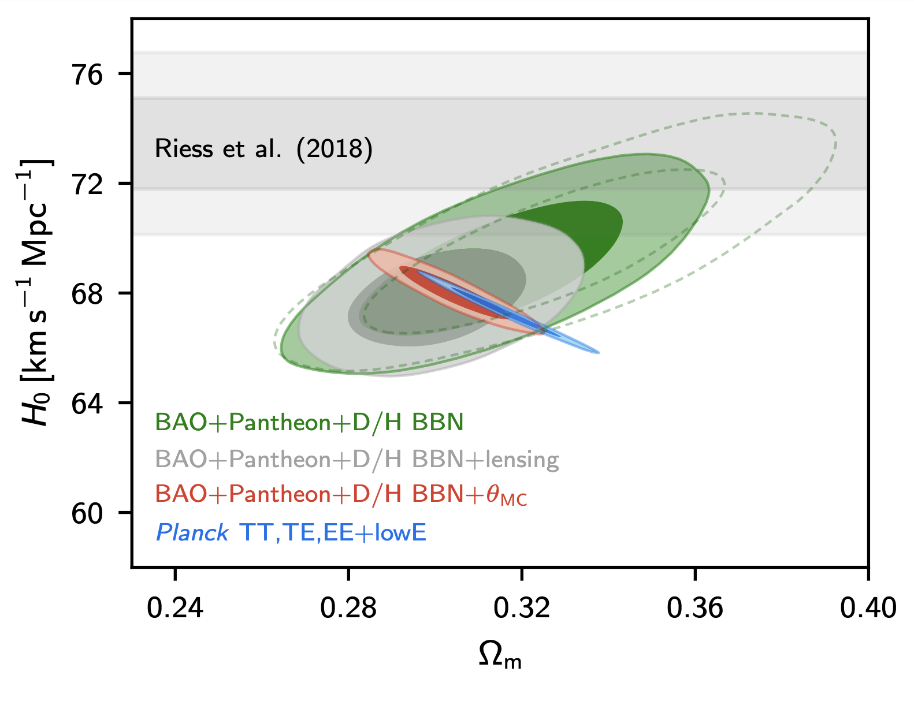

Current Research {#ch:current-research}
===================================

In this section we will look at the current research that is being undertaken to measure the Hubble constant, $H_0$. We will not be going into the technical details of every experiment here, but you are welcome to look at the original papers if you wish to learn more.

Under normal circumstances this part of the course would have been a discussion session, with each of you reading one of a selection of papers and discussing it in a group. As the format has been changed, you are not expected to read the papers, but you are expected to understand the main points that are summarised in this chapter. 

Independent $H_0$ measurements {#sec:independent-ho}
-----------------
In Chapters \@ref(ch:obs-techs) and \@ref(ch:obs-techs-cmb) we looked at how the distance ladder and the cosmic microwave background could provide estimates of $H_0$. However, these two techniques are not the only ways we can find $H_0$. In fact, it is useful to combine different techniques, as each will constrain the parameters in the cosmological model in different ways.

Figure \@ref(fig:planck-corr) shows how different parameters are constrained by the *Planck* experiment. 

```{r echo=FALSE, planck-corr, out.width='100%', fig.show='hold', fig.cap="Results from @Planck18. The different coloured ellipses represent different analyses of the data. Grey, red, and blue represent the results using only *Planck* data, with green ellipses combining the *Planck* data with results from Baryon Acoustic Oscillations (BAO) experiments."}
knitr::include_graphics("Images/planck-res.jpg")
```

In Fig. \@ref(fig:planck-corr), the grey, red, and blue ellipses show the constraints on each parameter when *only* the *Planck* data is used. The green ellipses show the constraints from including data from a **baryon acoustic oscillations* (BAO) experiment in the model. Looking at the top left panel of Fig. \@ref(fig:planck-corr), which shows the constraints on $H_0$ and $\Omega_{b}h^2$, we can see that including the BAO data has a significant effect on the values of $H_0$ and $\Omega_{b}h^2$. For other panels, for example $\sigma_8$ vs $\Omega_{c}h^2$ (bottom row, second panel from the left), we can see that including the BAO data doesn't have much of an effect.

Another interesting comparison to make is between the *Planck* and distance ladder results. Figure \@ref(fig:planck-shoes) shows the constraints on $H_0$ and $\Omega_m$ from *Planck*, BAO experiments, and the SH$_0$ES experiment [@Riess2018]. While *Planck* and BAO put joint constraints on $\Omega_m$ and $H_0$, SH$_0$ES *only* constrains $H_0$. The difference is that the SH$_0$ES value for $H_0$ is direct -- it does not depend on the other parameters in the cosmological model. 

```{r echo=FALSE, planck-shoes, out.width='80%', fig.show='hold', fig.cap="Constraints on $H_0$ and $\\Omega_m$ from *Planck* (blue ellipses), BAO experiments (green and grey ellipses), *Planck* and BAO combined (red ellipses), and the distance ladder results from @Riess2018 (grey bar). Figure fromfrom @Planck18. "}

```

The important thing to take away from this figure is that the independent experiments appear to **not agree** on the value of the Hubble constant. This disagreement is known as the **Hubble tension**. 


Figure \@ref(fig:ho-tension) shows a selection of $H_0$ measurements taken since 2001 using a selection of techniques. Pink circles indicate standard candle measurements; blue hexagons indicate standard ruler measurements from the *WMAP* experiment; green squares indicate results from *Planck*; yellow triangles indicate standard siren measurements from gravitational waves. The pink star is the result from the Carnegie Hubble Program [@CHP2012], which was the project I worked on measuring $H_0$ using mid-infra-red observations of Cepheids. The dashed lines represent the (unweighted) mean values of $H_0$ from each technique, with the shaded regions representing the 1$\sigma$ uncertainty on that value. 

```{r echo=FALSE, ho-tension, out.width='100%', fig.show='hold', fig.cap="Measurements of $H_0$ from different experiments published since 2001. Pink circles indicate standard candle measurements; blue hexagons indicate standard ruler measurements from the *WMAP* experiment; green squares indicate results from *Planck*; yellow triangles indicate standard siren measurements from gravitational waves."}
knitr::include_graphics("Images/ho-tension.png")
```

The first thing you may notice is that the standard candle mean (pink) agrees with the *WMAP* measurements (blue). But what do we mean by 'agrees with' in this context? We can say that measurements agree statistically if they are the same within their associated uncertainties. In this case, the standard candle average is $H_{0, \text{SC}}$ = 73.5 $\pm$ 0.9 km s$^{-1}$ Mpc$^{-1}$ and the *WMAP* average is $H_{0, \text{W}}$ = 71.5 $\pm$ 1.3 km s$^{-1}$ Mpc$^{-1}$. The difference between these values, $\Delta H_0$, is 
\begin{align}
\Delta H_0 &= H_{0, \text{SC}} - H_{0, \text{W}} \\
\Delta H_0 &= 73.5 - 71.5\\
\Delta H_0 &= 2.0 \text{ km s}^{-1} \text{ Mpc}^{-1}
    (\#eq:delta-ho)
\end{align}

The uncertainty on $\Delta H_0$, $\sigma_{\Delta}$, is found by summing the uncertainties in quadrature:
\begin{align}
\sigma_{\Delta} &= \sqrt{\sigma_C^2 + \sigma_W^2} \\
\sigma_{\Delta} &= \sqrt{0.9^2 + 1.3^2}\\
\sigma_{\Delta} &= 1.6 \text{ km s}^{-1} \text{ Mpc}^{-1}
    (\#eq:delta-ho-2)
\end{align}

So the two values differ by 1.25$\sigma_{\Delta}$. Is this a real difference?

Gaussian Uncertainties {#sec:gaussian-unc}
--------------

We assume that the uncertainties follow a **Gaussian distribution**. For a Gaussian distribution, the probability of measuring a value $x$ when the true value is $\langle x \rangle$ with an uncertainty $\sigma$ is shown in Figure \@ref(fig:gaussian). 

```{r echo=FALSE, gaussian, out.width='100%', fig.show='hold', fig.cap="Gaussian uncertainties. If we measure a value $x$ for a variable that has a true value $\\langle x \\rangle$ and uncertainty $\\sigma$, there is a 68.3% probability that $x$ will be within $\\langle x \\rangle \\pm 1\\sigma$. There's a 95.4% probability of $x$ being within $\\langle x \\rangle \\pm 2\\sigma$, and 99.7% of $x$ being within  $\\langle x \\rangle \\pm 3\\sigma$."}
knitr::include_graphics("Images/normal-curve.png")
```

We can see from Fig.\@ref(fig:gaussian) that (statistically speaking) it's quite likely for us to measure a value that is 1.25$\sigma$ away from the "true" value. There's approximately a 21% chance of measuring a difference greater than $\pm$ 1.25 $\sigma$. **Note:** If you want to calculate the probability of measuring a give $\sigma$ deviation you can use a statistical table, such as [this one](https://en.wikipedia.org/wiki/Standard_normal_table#Cumulative_from_mean_(0_to_Z)).

So when is the difference significant? When would we say that the values don't agree? It's common in astronomy to use 3$\sigma$ as the limit for statistical significance. As Fig. \@ref(fig:gaussian) shows, there's only a 0.3% chance of a measurement that is more than 3$\sigma$ away from the mean occurring by chance. So we say that a measurement is consistent if it is within 3$\sigma$ of the expected value, and discrepant if if lies further away than 3$\sigma$.

We can now go back to Fig. \@ref(fig:ho-tension). We've shown that the standard candle and *WMAP* measurements are significant, but can we say the same about the *Planck* measurements? The mean of the *Planck* values is $H_{0, \text{P}}$ = 67.5 $\pm$ 0.3 km s$^{-1}$ Mpc$^{-1}$, lower than both the previous values and with a smaller uncertainty. Doing the same calculations as in Eqs. \@ref(eq:delta-ho) and \@ref(eq:delta-ho-2), we find that the measurements differ by $\Delta$ = 6.0 $\pm$ 1.0 km s$^{-1}$ Mpc$^{-1}$, corresponding to a 6$\sigma$ difference! The probability of this occurring by chance is approximately $10^{-9}$. It's extremely unlikely that a difference of this size is due to a statistical fluctuation and the measurements are **not** consistent. 

One thing to note about this example is that we're comparing the means from several experiments. Things like the way in which you calculate the averages, which measurements are included, etc. can all affect the result. So this isn't an ideal or unbiased comparison, but it illustrates how to calculate whether measurements agree statistically. 

The $H_0$ tension {#sec:ho-tension}
-----------------

In the previous section we showed that the standard candle and *Planck* measurements of $H_0$ are statistically different from each other. This is strange - surely both experiments should give the same result? This difference is known as the **Hubble tension** (or $H_0$ tension). The Hubble tension is one of the big open questions in Cosmology at the moment. Recall Fig. \@ref(fig:ho-distance-ladder) in Sec. \@ref(sec:ho-distance-ladder), which showed $H_0$ measurements taken since 1930. The early measurements were very far from our current measurements, but the values came into agreement, reaching consensus around 2000. That agreement existed until the first results from *Planck* in 2013, and the disagreement between *Planck* and standard candle experiments has increased as the uncertainties on all experiments have improved. 

The possible explanations for the Hubble tension fall into two distinct categories:

1. Experimental error 
2. New physics

Experimental error could come from a number of sources. There could be an error in the *Planck* analysis, in the standard candle analysis, or in both. All the different groups working on these experiments have tried to quantify the uncertainties in their experiments as completely as possible, but it is possible that there are biases or other sources of uncertainty that haven't been taken into account. Underestimation of the uncertainties would make the difference seem larger than it really is. 

New physics is the more exciting answer to the Hubble tension. Is there something else that we should be including in the cosmological model that we've missed out? However, we can't justify adding new physics until we've investigated the possibilities of experimental error. 

One way to address the experimental error aspect is to devise a new, completely independent experiment to measure $H_0$. This is where the yellow points on Fig \@ref(fig:ho-tension) come in. These correspond to the first measurements of $H_0$ made using **gravitational waves**.

Standard sirens {#sec:standard-siren}
-------
In addition to standard candles and standard rulers, we now have a third tool to measure astronomical distances. Gravitational wave measurements can be used as **standard sirens**. Standard sirens work in a similar way to standard candles, but instead of considering the luminosity of light coming from the source, we're using the gravitational waves.

We can't just look at any old object to get a standard siren measurement. We need to observe a binary system just as the components are inspiralling so we can see the gravitational wave signal. Using this gravitational wave signal, known as a "chirp", we can find a model describing the masses of the binary objects that best fits the observed signal. Knowing the masses gives us the amount of energy emitted in gravitational waves. By comparing this to the gravitational waves observed on Earth, and assuming that general relativity holds, we can calculate the distance to the event, much like we would do by comparing the absolute and apparent magnitudes of a Cepheid.

In order to measure the Hubble constant from gravitational waves, we also need the redshift of the system as 
\begin{equation}
H_0 = \dfrac{v}{D}
(\#eq:ho-red)
\end{equation}
and we need the redshift, $z$ to get the recession velocity $v$.

Luckily, in 2017, the gravitational wave event GW170817 gave us everything we needed. The gravitational wave signal was localised to the galaxy NGC 4993. As the event coincided with this galaxy, the redshift of the galaxy could be used to determine the recession velocity, and the Hubble constant could be estimated as $70^{+12}_{-8}$ km s$^{-1}$ Mpc$^{-1}$.

The first thing to note about this result is its uncertainty. It's big -- about 10 times bigger than the uncertainties on the more traditional measurements. If we did the same calculations as before to see whether it was consistent with previous results, we'd find it agreed with everything. This isn't particularly useful for breaking the tie between our experiments. 

However, this measurement was from **just one object**. Distance ladder measurements of $H_0$ use large samples of supernovae; this is the equivalent of measuring $H_0$ from a single supernova. So as we increase the sample size of standard sirens, our uncertainty on $H_0$ should decrease, with the statistical uncertainty decreasing approximately proportionally to $\sqrt{N}$, where $N$ is the number of objects. But right now, we can't use standard sirens to break the Hubble tension.

Other possibilities for exploring the experimental error possibility include:

 - Replacing Cepheids in the distance ladder with a different standard candle
 - Improving the parallax calibration of the distance ladder
 - Increasing the sample size of supernovae by looking at different types of host galaxies
 - Making independent measurements of the CMB with experiments other than *Planck*, such as the South Pole Telescope.
 
 The above list is not complete, and there are many other ways we can test our results from standard candles and standard rulers. 
 
 
New Physics? {#sec:new-phys}
--------------------
 
 If we can rule out experimental error as the source of the Hubble tension, then we could be seeing the effects of "new physics" that hasn't been included in the $\Lambda$CDM model. As the standard candle $H_0$ measurements are independent of the $\Lambda$CDM model they will not change. We'll be looking for changes to existing parameters, or additional parameters, in $\Lambda$CDM that drive the *Planck* measurements upwards to agree with other results.
 
Figure \@ref(fig:riess19-fig4) shows how the standard candle result from @Riess2019 (red point, labelled "Here") compares to other standard candle results (other red points) and standard ruler results (blue points). @Riess2019 used an improved calibration of the distance ladder, using eclipsing binary systems in the Large Magellanic Cloud to calibrate the Leavitt law. Using this new calibration they found $H_0 = 74.03 \pm 1.42$ km s$^{-1}$ Mpc$^{-1}$. This is still higher than the *Planck* measurement, and the reduced uncertainty compared to previous standard candle measurements means the difference is now statistically significant at 4.4$\sigma$. 

```{r echo=FALSE, riess19-fig4, out.width='80%', fig.show='hold', fig.cap="The 4.4$\\sigma$ difference between local measurements of $H_0$ and the value predicted from Planck+$\\Lambda$CDM. Possible physics causes for a 2%–4% change in $H_0$ include time-dependent dark energy or nonzero curvature, while a larger 5%– 8% difference may come from dark matter interaction, early dark energy or additional relativistic particles. From @Riess2019."}
knitr::include_graphics("Images/riess19-fig4.jpg")
```

The horizontal arrows from the 'NEW PHYSICS' section of Fig. \@ref(fig:riess19-fig4) show how changes to $\Lambda$CDM would affect the *Planck* result, bringing it into agreement with @Riess2019. For example, removing the assumption that we live in a flat ($k=0$) Universe and allowing $k$ (hence $\Omega_k$) to be a free parameter in the model increases the *Planck* $H_0$ value making the difference statistically insignificant. Changing $w$, which parameterises the dark energy equation of state, has a similar effect. Dark energy could have also had non-negligible effect on the Universe at early times. 

While some of the changes to $\Lambda$CDM may have little immediate effect on life on Earth and physics in general, some of the proposed changes are more fundamental. Changing the number of relativistic particles, $N_{\text{eff}}$ in $\Lambda$CDM by 0.4 -- i.e. increasing the number of neutrinos or increasing the masses of existing neutrinos -- can bring the $H_0$ measurements into agreement. But now we're messing with the standard model of particle physics, not just cosmology! Can we do that? Maybe. Another suggestion is that dark matter could interact with relativistic particles (such as neutrinos). Again, this is changing a part of physics that we thought was well understood!

All of these extensions and changes to $\Lambda$CDM are speculation right now and have not been proven. However, they highlight the importance of resolving the Hubble tension one way or another. If we can resolve the tension with independent measurements or with improvements to existing experiments, then we don't need to add new physics to $\Lambda$CDM. If this doesn't happen, and our uncertainties keep dropping and the tension keeps increasing, changes to $\Lambda$CDM and/or other branches of fundamental physics will need to be seriously considered.

Conclusions {#sec:conclusions}
--------
You have now reached the end of this special COVID-19 edition of PH40112 Relativistic Cosmology. I hope that you've learned something new and interesting during this course (other than how to use Microsoft Teams). I know it's been a strange time for everyone, and I'm sad to not have been able to teach this course with you all in the room. Thank you for bearing with me while I've converted the course to an on-line version. 

I hope that in a few years time I see one (or more!) of your names on the author list for the paper that solves the Hubble tension, whichever way it goes (obvs the correct value is the one I published in @CHP2012... but I'll leave it up to you to prove that independently).


```{r echo=FALSE, aliens, out.width='80%', fig.show='hold'}
knitr::include_graphics("Images/aliens.gif")
```


